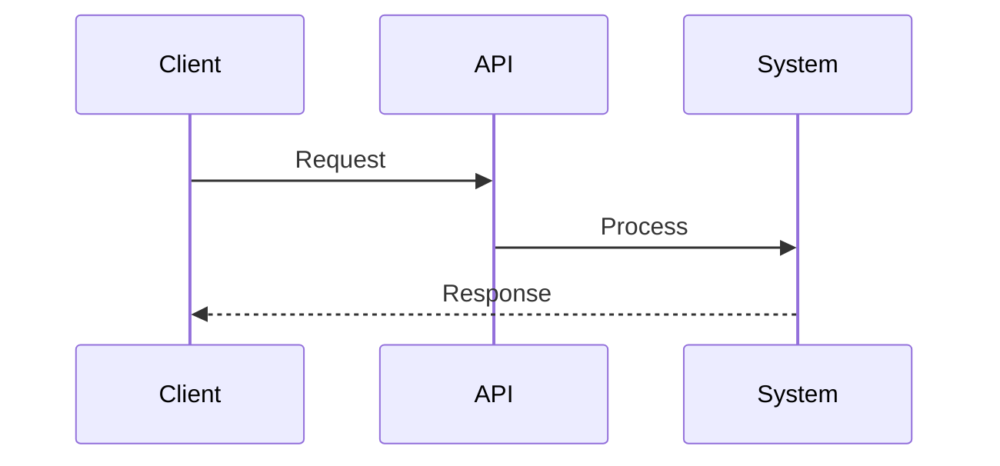
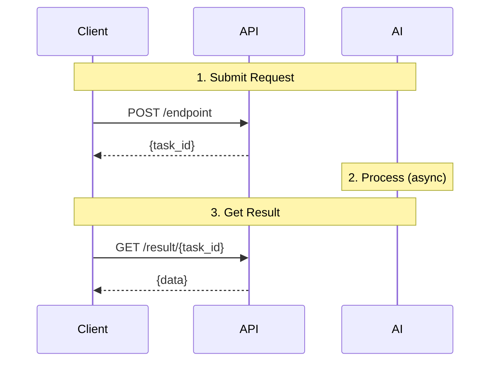

# JoggAI API Documentation Guide

This guide explains the structure, conventions, and best practices used in the JoggAI API documentation.

## Documentation Style

The documentation follows the official [JoggAI API documentation](https://docs.jogg.ai/api-reference) style:

- **Clean and minimal** - Focus on essential information
- **English language** - All user-facing content in English
- **Code examples in bash/curl** - Consistent format across all pages
- **Practical examples** - Real-world use cases and workflows
- **Mermaid diagrams** - Visual workflow representation using sequence diagrams

## File Organization

### Core Files

| File | Purpose |
|------|---------|
| `index.mdx` | Homepage with quick start guide |
| `quickstart.mdx` | Detailed quick start guide |
| `docs.json` | Mintlify configuration and navigation |
| `api-reference/openapi-v2.yaml` | OpenAPI specification (auto-generates API docs) |
| `api-reference/joggai-introduction.mdx` | API overview and authentication |

### Content Structure

```
api-reference/
├── joggai-introduction.mdx          # API overview
├── openapi-v2.yaml                  # OpenAPI spec
└── workflows/                       # Workflow guides
    ├── ai-scripts.mdx               # AI script generation
    ├── create-photo-avatar.mdx      # Photo avatar creation
    ├── create-video-from-product.mdx
    ├── create-video-from-template.mdx
    ├── video-translation.mdx
    ├── webhook-integration.mdx
    ├── avatar-videos/               # Avatar video workflows (collapsible group)
    │   ├── avatar-videos-overview.mdx
    │   ├── avatar-videos-with-photo-avatar.mdx
    │   ├── avatar-videos-with-audio-source.mdx
    │   └── avatar-videos-transparent-background.mdx
    └── upload-media/                # Media upload workflows (collapsible group)
        ├── upload-media-overview.mdx
        ├── upload-media-images.mdx
        ├── upload-media-videos.mdx
        └── upload-media-audio.mdx
```

### Documentation Organization Principles

1. **Single documents** for straightforward workflows (6 files)
2. **Collapsible groups** for complex multi-scenario workflows (2 groups, 8 files)
3. **Consistent file prefixes** within groups (e.g., `avatar-videos-*`, `upload-media-*`)
4. **Overview documents** for grouped workflows to provide context

## Writing Guidelines

### 1. Page Structure (Standard Workflow)

Every workflow MDX page should follow this structure:

```mdx
---
title: "Workflow Title"
description: "Brief one-sentence description"
---

## Introduction

Brief overview with benefits using CardGroup.

<CardGroup cols={2}>
  <Card title="Benefit 1" icon="icon-name">
    Description
  </Card>
  <Card title="Benefit 2" icon="icon-name">
    Description
  </Card>
</CardGroup>

## Workflow Overview



## Quick Start

Simple example to get started quickly.

## Complete Workflow

<Steps>
  <Step title="Step 1">
    Detailed instructions with code
  </Step>
  <Step title="Step 2">
    Next step
  </Step>
</Steps>

## Best Practices

<AccordionGroup>
  <Accordion title="Practice 1">
    Explanation
  </Accordion>
</AccordionGroup>

## Common Issues

<AccordionGroup>
  <Accordion title="Problem">
    Solution
  </Accordion>
</AccordionGroup>

## Next Steps

<CardGroup cols={2}>
  <Card title="Related" href="/path">
    Description
  </Card>
</CardGroup>

## Need Help?

Contact information
```

### 2. Code Examples

**Always use bash/curl format:**

```bash
curl --request POST \
  --url 'https://api.jogg.ai/open/v2/endpoint' \
  --header 'x-api-key: YOUR_API_KEY' \
  --header 'Content-Type: application/json' \
  --data '{
    "key": "value"
  }'
```

**Include expected responses:**

```json
{
  "code": 0,
  "msg": "success",
  "data": {
    "result": "value"
  }
}
```

**Breaking down large examples:**

Instead of one large curl command, break into steps:

```bash
# Step 1: Upload media
curl -X POST 'https://api.jogg.ai/open/v2/upload' \
  -H 'x-api-key: YOUR_API_KEY' \
  -F 'file=@image.jpg'

# Step 2: Create video
curl -X POST 'https://api.jogg.ai/open/v2/create_video' \
  -H 'x-api-key: YOUR_API_KEY' \
  -d '{"asset_id": "..."}'
```

### 3. Mermaid Diagrams

Use sequence diagrams for workflows:

````markdown

````

### 4. Component Usage

#### Cards for Navigation and Features

```mdx
<CardGroup cols={2}>
  <Card title="Feature Name" icon="icon-name" href="/path">
    Brief description of the feature
  </Card>
  <Card title="Another Feature" icon="icon-name">
    Description without link
  </Card>
</CardGroup>
```

**Common icons:**
- `user`, `video`, `image`, `microphone`, `upload`
- `wand-magic-sparkles`, `language`, `webhook`
- `check`, `warning`, `info`, `question`

#### Steps for Sequential Instructions

```mdx
<Steps>
  <Step title="First Action">
    Explanation and code example.
    
    ```bash
    curl command
    ```
    
    **Response:**
    ```json
    {...}
    ```
  </Step>
  
  <Step title="Second Action">
    Next step with details.
  </Step>
</Steps>
```

#### Accordions for Collapsible Content

```mdx
<AccordionGroup>
  <Accordion title="Topic Name">
    Detailed explanation that can be collapsed.
    
    **Example:**
    Code or additional details.
  </Accordion>
  
  <Accordion title="Another Topic">
    More content.
  </Accordion>
</AccordionGroup>
```

#### Callouts for Important Information

```mdx
<Note>Standard information or prerequisites</Note>

<Info>Helpful tips or additional context</Info>

<Warning>Important warnings about limitations or issues</Warning>

<Tip>Pro tips and optimization suggestions</Tip>

<Check>Success indicators or confirmation messages</Check>
```

### 5. MDX Best Practices

#### ✅ DO: Use Paragraph Descriptions in Components

```mdx
<Accordion title="Problem">
**Problem:** Description of the issue

**Solution:** First do this. Then do that. Finally, complete the process.
</Accordion>
```

```mdx
<Step title="Configure Settings">
Configure your settings. Ensure all required fields are filled. Save the configuration.

</Step>
```

#### ❌ DON'T: Use Lists Directly After Colons

This causes MDX parsing errors:

```mdx
<Accordion title="Problem">
**Solutions:**
- Item 1
- Item 2
</Accordion>
```

#### ✅ DO: Add Proper Separation for Lists

If you must use lists, add a descriptive header:

```mdx
<Step title="Requirements">
Ensure you have the following ready.

Required items:
- Item 1
- Item 2
- Item 3

</Step>
```

### 6. Writing Style

- **Be concise** - Get to the point quickly
- **Use active voice** - "Create a video" not "A video is created"
- **Include examples** - Show, don't just tell
- **Link related content** - Help users navigate
- **Explain errors** - Include common issues and solutions
- **Use consistent terminology** - Stick to standard terms (e.g., "avatar" not "digital person")

### 7. Internal Links

**Workflow documents:**
```markdown
[Avatar Videos](/api-reference/workflows/avatar-videos/avatar-videos-overview)
```

**API Reference (auto-generated):**
```markdown
Refer to the **Video Creation** section in the API Reference tab
```

**Don't** link directly to auto-generated API pages as URLs may change.

## Navigation Structure

### Collapsible Groups

For complex workflows with multiple scenarios, use collapsible navigation groups:

**In `docs.json`:**
```json
{
  "group": "Create Avatar Videos",
  "pages": [
    "api-reference/workflows/avatar-videos/avatar-videos-overview",
    "api-reference/workflows/avatar-videos/avatar-videos-with-photo-avatar",
    "api-reference/workflows/avatar-videos/avatar-videos-with-audio-source",
    "api-reference/workflows/avatar-videos/avatar-videos-transparent-background"
  ]
}
```

**When to split:**
- Document exceeds 500 lines
- Multiple distinct scenarios or use cases
- Each scenario needs detailed explanation
- Users typically focus on one scenario at a time

**File naming:**
- Use consistent prefix: `{group-name}-{scenario}.mdx`
- Include overview document: `{group-name}-overview.mdx`
- Keep names descriptive but concise

### Current Navigation Structure

```json
{
  "tabs": [
    {
      "name": "API Documentation",
      "url": "api-reference"
    }
  ],
  "navigation": [
    {
      "group": "Getting Started",
      "pages": ["api-reference/joggai-introduction"]
    },
    {
      "group": "Workflow Guides",
      "pages": [
        "api-reference/workflows/ai-scripts",
        "api-reference/workflows/create-photo-avatar",
        "api-reference/workflows/create-video-from-product",
        "api-reference/workflows/create-video-from-template",
        "api-reference/workflows/video-translation",
        "api-reference/workflows/webhook-integration"
      ]
    },
    {
      "group": "Create Avatar Videos",
      "pages": [
        "api-reference/workflows/avatar-videos/avatar-videos-overview",
        "api-reference/workflows/avatar-videos/avatar-videos-with-photo-avatar",
        "api-reference/workflows/avatar-videos/avatar-videos-with-audio-source",
        "api-reference/workflows/avatar-videos/avatar-videos-transparent-background"
      ]
    },
    {
      "group": "Upload Media",
      "pages": [
        "api-reference/workflows/upload-media/upload-media-overview",
        "api-reference/workflows/upload-media/upload-media-images",
        "api-reference/workflows/upload-media/upload-media-videos",
        "api-reference/workflows/upload-media/upload-media-audio"
      ]
    }
  ]
}
```

## Document Length Guidelines

| Document Type | Target Length | Max Length |
|---------------|---------------|------------|
| Simple workflow | 200-300 lines | 400 lines |
| Complex workflow | 300-400 lines | 500 lines |
| Overview document | 300-350 lines | 400 lines |
| Sub-scenario document | 200-350 lines | 400 lines |

**If a document exceeds 500 lines:**
1. Identify distinct scenarios or use cases
2. Create a new subdirectory with group prefix
3. Split into overview + scenario-specific documents
4. Add collapsible group to navigation
5. Ensure consistent file naming

## API Reference

The API reference is auto-generated from `openapi-v2.yaml`:

### OpenAPI Structure

```yaml
tags:
  - name: video
    description: Video creation and management
  - name: avatar
    description: Avatar management
  - name: webhook
    description: Webhook configuration

paths:
  /open/v2/create_video_from_avatar:
    post:
      tags: [video]
      summary: Create Talking Avatar Video
      operationId: createAvatarVideo
```

### Mintlify URL Generation

Mintlify generates URLs in format:
```
/api-reference/{tag}/{summary-slug}
```

Example:
```
/api-reference/video/create-talking-avatar-video
```

**Don't** hard-code these URLs in workflow documents. Instead, refer generically:
```markdown
For detailed API specifications, refer to the **Video Creation** section in the API Reference tab.
```

## Common Patterns

### Error Handling Pattern

```mdx
## Common Issues

<AccordionGroup>
  <Accordion title="Error: Invalid API Key">
    **Problem:** API returns 401 Unauthorized
    
    **Solution:** Verify your API key is correct and active. Get your key from the dashboard at https://app.jogg.ai
  </Accordion>
  
  <Accordion title="Request Timeout">
    **Problem:** Request times out after 30 seconds
    
    **Solution:** The operation is asynchronous. Use webhooks or polling to check status. Don't wait for immediate response.
  </Accordion>
</AccordionGroup>
```

### Parameter Table Pattern

```mdx
| Parameter | Type | Required | Description |
|-----------|------|----------|-------------|
| `script` | string | Yes | Video script text (max 5000 characters) |
| `avatar_id` | number | Yes | Avatar ID from library |
| `voice_id` | string | Yes | Voice ID in format `{lang}-{region}-{name}Neural` |
```

### Status Code Pattern

```mdx
| Status | Description | Next Action |
|--------|-------------|-------------|
| `pending` | Task queued | Wait for processing |
| `processing` | In progress | Continue polling |
| `completed` | Finished | Download result |
| `failed` | Error occurred | Check error message |
```

## Maintenance

### Adding a New Workflow

1. **Create the MDX file**
   ```bash
   touch api-reference/workflows/new-workflow.mdx
   ```

2. **Add frontmatter and content**
   - Follow the standard structure template
   - Include mermaid diagram
   - Add code examples
   - Include troubleshooting

3. **Add to navigation in `docs.json`**
   ```json
   {
     "group": "Workflow Guides",
     "pages": [
       "api-reference/workflows/new-workflow"
     ]
   }
   ```

4. **Test locally**
   ```bash
   mintlify dev
   ```

5. **Verify**
   - Check navigation shows correctly
   - Test all internal links
   - Verify code examples render
   - Check mermaid diagrams display

### Splitting a Large Document

1. **Create subdirectory**
   ```bash
   mkdir api-reference/workflows/feature-name
   ```

2. **Create overview document**
   ```bash
   touch api-reference/workflows/feature-name/feature-name-overview.mdx
   ```

3. **Create scenario documents**
   ```bash
   touch api-reference/workflows/feature-name/feature-name-scenario-1.mdx
   touch api-reference/workflows/feature-name/feature-name-scenario-2.mdx
   ```

4. **Update `docs.json` with collapsible group**
   ```json
   {
     "group": "Feature Name",
     "pages": [
       "api-reference/workflows/feature-name/feature-name-overview",
       "api-reference/workflows/feature-name/feature-name-scenario-1",
       "api-reference/workflows/feature-name/feature-name-scenario-2"
     ]
   }
   ```

5. **Delete original large file**
   ```bash
   rm api-reference/workflows/feature-name.mdx
   ```

### Updating API Endpoints

1. Edit `api-reference/openapi-v2.yaml`
2. Mintlify auto-generates the documentation
3. No manual updates needed for API pages

### Removing Pages

1. Delete the MDX file(s)
2. Remove from `docs.json` navigation
3. Update any workflow documents with links to removed pages
4. Test to ensure no broken links

## Testing

### Local Testing Checklist

```bash
# Start development server
mintlify dev

# Visit http://localhost:3000
```

**Check:**
- [ ] All pages load without errors
- [ ] Navigation works correctly
- [ ] Collapsible groups expand/collapse
- [ ] Internal links work
- [ ] Code examples render with syntax highlighting
- [ ] Mermaid diagrams display correctly
- [ ] Callout components (Note, Warning, etc.) render
- [ ] Tables are properly formatted
- [ ] No console errors in browser

### Common Issues & Solutions

| Issue | Cause | Solution |
|-------|-------|----------|
| `parsing error: Expected closing tag` | List directly in component | Convert list to paragraph or add proper separation |
| `404 on internal link` | Incorrect path or file doesn't exist | Verify file path matches docs.json |
| `Mermaid diagram not showing` | Syntax error in diagram | Validate mermaid syntax at mermaid.live |
| `Code block not highlighting` | Missing language identifier | Add language after opening triple backticks |
| `Component not rendering` | Typo in component name | Check spelling (case-sensitive) |

## Best Practices Summary

### DO ✅

- Use consistent bash/curl format for all code examples
- Include expected responses after requests
- Add mermaid sequence diagrams for complex workflows
- Use collapsible Accordions for detailed content
- Link to related workflows in "Next Steps"
- Convert lists to paragraphs in MDX components
- Test all code examples before publishing
- Keep documents under 500 lines (split if longer)
- Use consistent file prefixes in grouped documents
- Add descriptive frontmatter (title, description)

### DON'T ❌

- Mix multiple languages in code examples (stick to bash/curl)
- Hard-code API Reference URLs (they're auto-generated)
- Use lists directly after colons in MDX components
- Create documents over 500 lines without splitting
- Forget to update docs.json when adding/removing pages
- Use technical jargon without explanation
- Include pricing or commercial information in technical docs
- Duplicate the same content across multiple pages
- Link to external resources without explaining why

## Documentation Statistics

- **Total workflow documents**: 14
- **Collapsible groups**: 2 (Avatar Videos, Upload Media)
- **Average document length**: ~285 lines
- **Code format**: bash/curl only
- **Diagram format**: Mermaid sequence diagrams
- **Languages**: English only

## Resources

- [Mintlify Documentation](https://mintlify.com/docs)
- [Official JoggAI API Docs](https://docs.jogg.ai/api-reference)
- [OpenAPI 3.0 Specification](https://swagger.io/specification/)
- [MDX Documentation](https://mdxjs.com/)
- [Mermaid Diagrams](https://mermaid.js.org/)
- [Mintlify Components](https://mintlify.com/docs/content/components)

## Support

For documentation questions or issues:

- **Email**: support@jogg.ai
- **Discord**: https://discord.gg/RwrwZcSRCq
- **When reporting**:
  - Include page URL
  - Describe the issue clearly
  - Provide screenshots if applicable
  - Mention browser and OS if relevant

---

Last updated: December 2024
Version: 2.0 (Post-restructuring)
