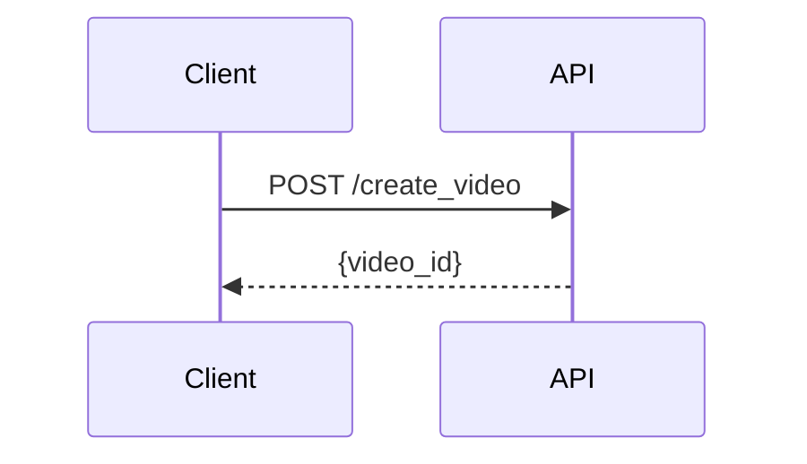

# JoggAI API Documentation

Official API documentation for JoggAI - Create AI-powered videos effortlessly.

## 🚀 Quick Start

### Prerequisites

- Node.js 20.17 or higher
- npm or yarn

### Installation

```bash
# Install Mintlify CLI
npm install -g mintlify

# Start development server
cd docs
mintlify dev
```

The documentation will be available at `http://localhost:3000`

## 📁 Project Structure

```
docs/
├── api-reference/
│   ├── joggai-introduction.mdx       # API overview
│   ├── openapi-v2.yaml               # OpenAPI specification
│   └── workflows/                    # Workflow guides
│       ├── ai-scripts.mdx            # AI script generation
│       ├── create-photo-avatar.mdx   # Photo avatar creation
│       ├── create-video-from-product.mdx
│       ├── create-video-from-template.mdx
│       ├── video-translation.mdx
│       ├── webhook-integration.mdx
│       ├── avatar-videos/            # Avatar video workflows
│       │   ├── avatar-videos-overview.mdx
│       │   ├── avatar-videos-with-photo-avatar.mdx
│       │   ├── avatar-videos-with-audio-source.mdx
│       │   └── avatar-videos-transparent-background.mdx
│       └── upload-media/             # Media upload workflows
│           ├── upload-media-overview.mdx
│           ├── upload-media-images.mdx
│           ├── upload-media-videos.mdx
│           └── upload-media-audio.mdx
├── images/                           # Documentation images
├── logo/                             # Brand assets
│   ├── light.svg
│   └── dark.svg
├── docs.json                         # Mintlify configuration
├── index.mdx                         # Homepage
├── quickstart.mdx                    # Quick start guide
└── README.md                         # This file
```

## 📚 Documentation Sections

### API Documentation

#### Getting Started
- **JoggAI Introduction** - API overview and authentication

#### Workflow Guides
Core workflows with complete examples:

- **AI Scripts** - Generate marketing scripts using AI
- **Create Photo Avatar** - Create custom avatars from photos
- **Create Video from Product** - Generate videos from product URLs
- **Create Video from Template** - Use templates for quick video creation
- **Video Translation** - Translate videos into 40+ languages
- **Webhook Integration** - Set up webhooks for real-time notifications

#### Avatar Videos (Collapsible Group)
- **Overview** - Introduction to avatar videos
- **With Photo Avatar** - Use custom photo avatars
- **With Audio Source** - Use your own audio files
- **Transparent Background** - Create videos with alpha channel

#### Upload Media (Collapsible Group)
- **Overview** - Media upload introduction
- **Images** - Upload and manage images
- **Videos** - Upload and manage videos
- **Audio** - Upload and manage audio files

### Auto-Generated API Reference
Mintlify automatically generates interactive API documentation from `openapi-v2.yaml`:
- 50+ endpoints organized by tags
- Request/response schemas
- Interactive playground
- Code examples in bash/curl

## 🔧 Configuration

The documentation is configured in `docs.json`:

### Key Features
- **Theme**: Blue color scheme (#2E5CFF)
- **OpenAPI Integration**: Auto-generated API reference
- **Navigation Groups**: Collapsible sections for complex workflows
- **Tabs**: Primary tab (Home) + API Documentation tab

### Navigation Structure

```json
{
  "navigation": [
    {
      "group": "Workflow Guides",
      "pages": [
        "api-reference/workflows/ai-scripts",
        "api-reference/workflows/create-photo-avatar",
        ...
      ]
    },
    {
      "group": "Create Avatar Videos",
      "pages": [
        "api-reference/workflows/avatar-videos/avatar-videos-overview",
        ...
      ]
    }
  ]
}
```

## 📝 Writing Documentation

### MDX Components

This documentation uses Mintlify's MDX components:

**Layout Components:**
- `<Card>` - Feature cards with icons
- `<CardGroup>` - Grid layout for cards (cols={2} or cols={3})
- `<Steps>` - Step-by-step instructions
- `<Step>` - Individual step within Steps

**Content Components:**
- `<Accordion>` - Collapsible content sections
- `<AccordionGroup>` - Group of accordions
- `<Note>`, `<Warning>`, `<Info>`, `<Tip>` - Callout boxes
- `<Check>` - Success indicators

**Code Display:**
- `<Tabs>` / `<Tab>` - Tabbed content
- Triple backticks with language for code blocks

### MDX Best Practices

#### ✅ Recommended

**Use paragraph descriptions instead of lists in components:**
```markdown
<Accordion title="Problem">
**Solution:** First do this. Then do that. Finally, complete the process.
</Accordion>
```

**Add clear separation between text and lists:**
```markdown
<Step title="...">
Complete these tasks.

Required items:
- Item 1
- Item 2
</Step>
```

#### ❌ Avoid

**Don't use lists directly after colons in components:**
```markdown
<Accordion title="...">
**Solutions:**
- Item 1  <!-- This causes parsing errors -->
</Accordion>
```

**Don't mix content without proper spacing:**
```markdown
<Step title="...">
Do this:
- Step 1  <!-- This causes parsing errors -->
</Step>
```

### Code Examples

All API code examples use bash/curl format:

```bash
curl --request POST \
  --url 'https://api.jogg.ai/open/v2/create_video_from_avatar' \
  --header 'x-api-key: YOUR_API_KEY' \
  --header 'Content-Type: application/json' \
  --data '{
    "script": "Your video script here",
    "avatar_id": 127,
    "voice_id": "en-US-ChristopherNeural"
  }'
```

### Mermaid Diagrams

Use Mermaid for workflow visualization:

````markdown

````

## 🎨 Document Structure Guidelines

### Workflow Documents

Each workflow document follows this structure:

1. **Introduction** - Overview and benefits (with CardGroup)
2. **Workflow Overview** - Mermaid sequence diagram
3. **Quick Start** - Simple example to get started
4. **Complete Workflow** - Step-by-step guide (using Steps component)
5. **Best Practices** - Tips and recommendations (using AccordionGroup)
6. **Common Issues** - Troubleshooting (using AccordionGroup)
7. **Next Steps** - Related documentation (using CardGroup)
8. **Need Help?** - Support contact

### Document Length Guidelines

- **Simple workflows**: 200-300 lines
- **Complex workflows**: 300-400 lines
- **Overview documents**: 300-350 lines

If a document exceeds 500 lines, consider splitting it into smaller, focused documents organized in a collapsible navigation group.

## 🔗 Links

- **Official Website**: https://jogg.ai
- **API Dashboard**: https://app.jogg.ai
- **API Base URL**: https://api.jogg.ai/open/v2
- **Support Email**: support@jogg.ai
- **Community**: https://discord.gg/RwrwZcSRCq

## 📄 License

See [LICENSE](LICENSE) file for details.

## 🤝 Contributing

### Documentation Updates

1. Create a new branch for your changes
2. Update relevant `.mdx` files
3. Test locally with `mintlify dev`
4. Ensure no parsing errors
5. Submit for review

### Adding New Workflow Guides

1. Create `.mdx` file in `api-reference/workflows/`
2. Follow the document structure guidelines above
3. Add to `docs.json` navigation
4. Test all internal links
5. Verify in local preview

## 🔄 Deployment

This documentation is deployed with Mintlify.

### Local Development

```bash
mintlify dev
```

### Production Deployment

The documentation is automatically deployed when changes are pushed to the main branch.

## 📦 API Specification

The OpenAPI specification (`api-reference/openapi-v2.yaml`) defines:

- **Endpoints**: 50+ API endpoints organized by tags
- **Schemas**: Request/response data structures
- **Authentication**: x-api-key header method
- **Parameters**: Path, query, body parameters
- **Examples**: Sample requests and responses

### OpenAPI Tags

Endpoints are organized by these tags:
- `video` - Video creation and management
- `avatar` - Avatar management
- `voice` - Voice management
- `template` - Template operations
- `media` - Media upload and management
- `webhook` - Webhook configuration
- `translation` - Video translation
- `script` - AI script generation

## 🐛 Troubleshooting

### Mintlify won't start

**Error:** `mint dev is not supported on node versions below 20.17`

**Solution:**
```bash
# Check Node.js version
node --version

# Upgrade Node.js using nvm
nvm install 20.17
nvm use 20.17
```

### MDX Parsing Errors

**Error:** `Expected the closing tag </Accordion>`

**Solution:** This usually occurs when lists are directly inside MDX components without proper spacing. Convert lists to paragraph descriptions or add clear separation.

**Before:**
```markdown
<Accordion title="...">
**Solutions:**
- Item 1
</Accordion>
```

**After:**
```markdown
<Accordion title="...">
**Solutions:** First do this, then do that, and finally complete the process.
</Accordion>
```

### Links Not Working

**Issue:** Internal links returning 404

**Solution:** 
1. Use relative paths from the docs root
2. For API Reference pages, use format: `/api-reference/{tag}/{endpoint-slug}`
3. Clear browser cache with Cmd+Shift+R (Mac) or Ctrl+Shift+R (Windows)

### Missing Pages in Navigation

**Issue:** Page exists but doesn't show in navigation

**Solution:** Ensure the page path in `docs.json` matches the actual file path without the `.mdx` extension.

## 📊 Documentation Statistics

- **Total Workflow Documents**: 14
- **Collapsible Groups**: 2 (Avatar Videos, Upload Media)
- **Average Document Length**: ~285 lines
- **Code Examples**: bash/curl only
- **Diagrams**: Mermaid sequence diagrams
- **Languages Supported**: English

## 📞 Support

For technical support or questions:

- **Email**: support@jogg.ai
- **Discord**: https://discord.gg/RwrwZcSRCq
- **Updates**: https://updates.jogg.ai

When reporting issues:
- Include your user ID (not API key)
- Provide error messages and timestamps
- Describe steps to reproduce

---

Built with ❤️ by the JoggAI team
