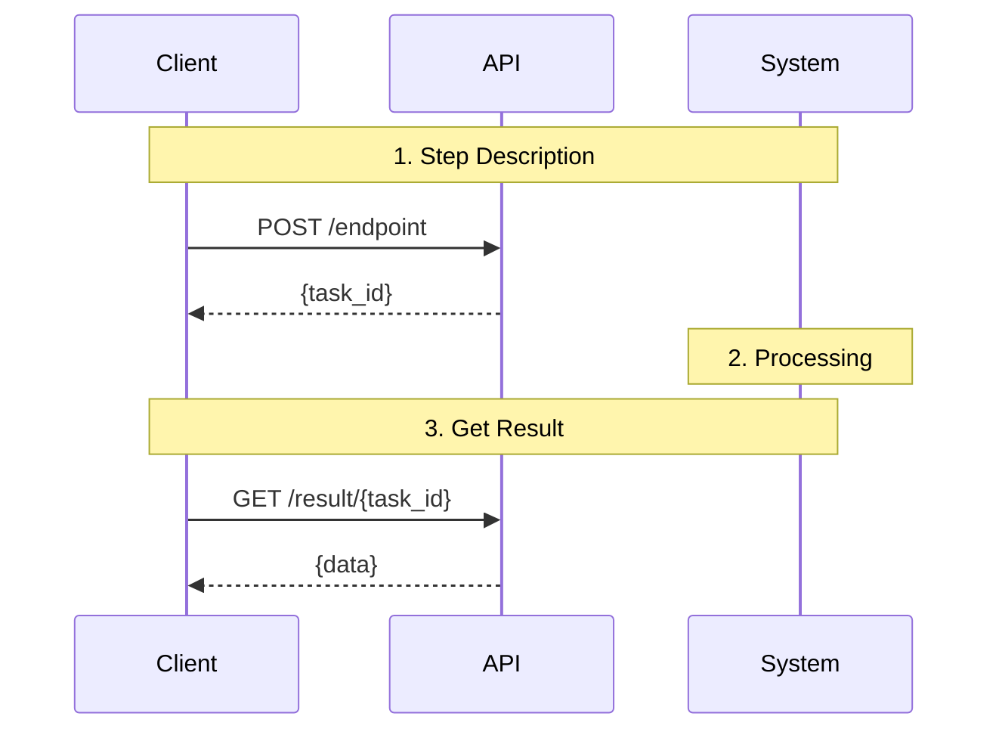
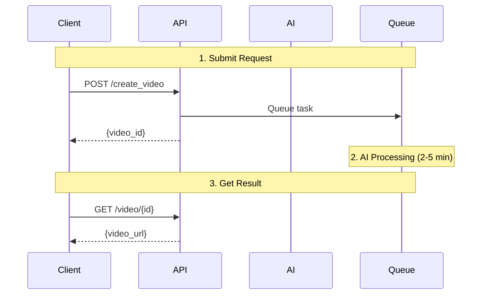

Use Cursor to help write and maintain JoggAI API documentation. This guide shows how to configure Cursor for technical writing tasks following our specific documentation standards.

## Prerequisites

- Cursor editor installed
- Access to JoggAI documentation repository
- Node.js 20.17+ for Mintlify

## Project Rules

Create `.cursor/rules.md` in your documentation repository root:

````markdown
# JoggAI API Documentation Rules

You are an AI writing assistant specialized in creating exceptional technical documentation for the JoggAI API using Mintlify components.

## JoggAI Documentation Standards

### Core Requirements

- **Language**: English only
- **Code format**: bash/curl ONLY (no other languages)
- **Diagrams**: Mermaid sequence diagrams for workflows
- **Structure**: Follow the standard workflow template
- **Length**: Keep documents under 500 lines (split if longer)
- **Components**: Use Mintlify MDX components consistently

### Document Organization

**File Structure:**
```
api-reference/
├── joggai-introduction.mdx
├── openapi-v2.yaml
└── workflows/
    ├── {workflow-name}.mdx           # Single-scenario workflows
    └── {feature-name}/               # Multi-scenario workflows
        ├── {feature-name}-overview.mdx
        ├── {feature-name}-scenario-1.mdx
        └── {feature-name}-scenario-2.mdx
```

**When to split documents:**
- Document exceeds 500 lines
- Multiple distinct scenarios exist
- Each scenario needs detailed explanation
- Use consistent file prefix: `{group-name}-{scenario}.mdx`

## Standard Workflow Template

Every workflow document MUST follow this structure:

```mdx
---
title: "Clear, Actionable Title"
description: "One-sentence description of what this accomplishes"
---

## Introduction

Brief overview with benefits using CardGroup (cols={2}).

<CardGroup cols={2}>
  <Card title="Benefit 1" icon="icon-name">
    Description of the benefit
  </Card>
  <Card title="Benefit 2" icon="icon-name">
    Another key benefit
  </Card>
</CardGroup>

## Workflow Overview



## Quick Start

Simple example to get users started quickly.

### Create Request

```bash
curl --request POST \
  --url 'https://api.jogg.ai/open/v2/endpoint' \
  --header 'x-api-key: YOUR_API_KEY' \
  --header 'Content-Type: application/json' \
  --data '{
    "key": "value"
  }'
```

**Response:**

```json
{
  "code": 0,
  "msg": "success",
  "data": {
    "result": "value"
  }
}
```

## Complete Workflow

<Steps>
  <Step title="First Action">
    Detailed explanation with code.
    
    ```bash
    curl command
    ```
    
    **Response:**
    ```json
    {...}
    ```
  </Step>
  
  <Step title="Second Action">
    Next step with full details.
  </Step>
</Steps>

## Best Practices

<AccordionGroup>
  <Accordion title="Practice Name">
    Explanation and recommendations.
  </Accordion>
</AccordionGroup>

## Common Issues

<AccordionGroup>
  <Accordion title="Problem Description">
    **Problem:** What goes wrong
    
    **Solution:** How to fix it step by step.
  </Accordion>
</AccordionGroup>

## Next Steps

<CardGroup cols={2}>
  <Card
    title="Related Workflow"
    icon="icon-name"
    href="/path/to/workflow"
  >
    Description of related content
  </Card>
</CardGroup>

## Need Help?

For questions about [topic], contact us at [support@jogg.ai](mailto:support@jogg.ai)
```

## Code Examples - CRITICAL RULES

### ✅ ALWAYS Use bash/curl Format

JoggAI documentation uses ONLY bash/curl for consistency:

```bash
curl --request POST \
  --url 'https://api.jogg.ai/open/v2/create_video_from_avatar' \
  --header 'x-api-key: YOUR_API_KEY' \
  --header 'Content-Type: application/json' \
  --data '{
    "script": "Your video script here",
    "avatar_id": 127,
    "voice_id": "en-US-ChristopherNeural",
    "aspect_ratio": 0
  }'
```

### ❌ NEVER Use Other Languages

**Don't use:**
- Python, JavaScript, Go, etc.
- CodeGroup with multiple languages
- Language-specific SDKs

**Reason:** Consistency across all documentation. Users can adapt curl examples to any language.

### Breaking Down Large Examples

Instead of one huge curl command, break into steps:

```bash
# Step 1: Upload media
curl -X POST 'https://api.jogg.ai/open/v2/upload/asset' \
  -H 'x-api-key: YOUR_API_KEY' \
  -F 'file=@image.jpg'

# Step 2: Use uploaded asset
curl -X POST 'https://api.jogg.ai/open/v2/create_video' \
  -H 'x-api-key: YOUR_API_KEY' \
  -d '{"asset_id": "aud_abc123"}'
```

### Response Examples

Always show expected responses:

```json
{
  "code": 0,
  "msg": "success",
  "data": {
    "project_id": "vid_abc123",
    "status": "processing"
  }
}
```

## Mermaid Sequence Diagrams

Use sequence diagrams to visualize workflows:

````markdown

````

**Guidelines:**
- Use participant labels: Client, API, AI, Queue, System
- Add `Note over` for step descriptions
- Show async processing clearly
- Include timing estimates

## MDX Component Rules - CRITICAL

### ⚠️ Lists in Components - Common Error

**❌ WRONG - Causes parsing errors:**

```mdx
<Accordion title="Solutions">
**Problem:** Description

**Solutions:**
- Item 1
- Item 2
</Accordion>
```

**Error:** `Expected closing tag </Accordion> after listItem`

**✅ CORRECT - Use paragraph descriptions:**

```mdx
<Accordion title="Solutions">
**Problem:** Description

**Solution:** First do this. Then do that. Finally, complete the process.
</Accordion>
```

**✅ CORRECT - Add proper separation:**

```mdx
<Step title="Requirements">
Ensure you have the following ready.

Required items:
- Item 1
- Item 2
- Item 3

</Step>
```

### Component Usage Guidelines

#### Steps - For Sequential Instructions

```mdx
<Steps>
  <Step title="Action Name">
    Clear explanation. Include code and responses.
    
    ```bash
    curl command
    ```
  </Step>
  
  <Step title="Next Action">
    Continue the flow.
  </Step>
</Steps>
```

#### Accordions - For Collapsible Details

```mdx
<AccordionGroup>
  <Accordion title="Topic">
    Content that can be collapsed. Use paragraph descriptions, not lists directly after colons.
  </Accordion>
</AccordionGroup>
```

#### Cards - For Navigation

```mdx
<CardGroup cols={2}>
  <Card
    title="Feature Name"
    icon="icon-name"
    href="/path"
  >
    Brief description
  </Card>
</CardGroup>
```

**Common icons:**
- `user`, `video`, `image`, `upload`, `microphone`
- `wand-magic-sparkles`, `language`, `webhook`
- `camera`, `film`, `music`, `globe`

#### Callouts - For Important Info

```mdx
<Note>Standard information or context</Note>

<Info>Helpful tips</Info>

<Warning>Important cautions or limitations</Warning>

<Tip>Pro tips and best practices</Tip>

<Check>Success confirmations</Check>
```

## Navigation and Linking

### Internal Links

**Workflow documents:**
```mdx
[Avatar Videos](/api-reference/workflows/avatar-videos/avatar-videos-overview)
```

**API Reference (auto-generated):**
```mdx
For detailed API specifications, refer to the **Video Creation** section in the API Reference tab.
```

**❌ Don't** link directly to auto-generated API pages (URLs may change):
```mdx
<!-- Don't do this -->
[API Endpoint](/api-reference/video/create-talking-avatar-video)
```

### Navigation Groups in docs.json

For multi-scenario workflows:

```json
{
  "group": "Feature Name",
  "pages": [
    "api-reference/workflows/feature-name/feature-name-overview",
    "api-reference/workflows/feature-name/feature-name-scenario-1",
    "api-reference/workflows/feature-name/feature-name-scenario-2"
  ]
}
```

## Writing Style

### Language Requirements

- **Active voice**: "Create a video" not "A video is created"
- **Present tense**: "The API returns" not "The API will return"
- **Second person**: "You can" not "One can" or "Users can"
- **Concise**: Remove unnecessary words
- **Specific**: "2-5 minutes" not "a few minutes"

### Technical Terms

- **Avatar** (not "digital person" or "virtual avatar")
- **Video** (not "clip" or "content")
- **Script** (not "text" or "narration")
- **API key** (not "token" or "credential")
- **Webhook** (not "callback" or "notification endpoint")

### Common Patterns

**Parameters table:**
```mdx
| Parameter | Type | Required | Description |
|-----------|------|----------|-------------|
| `script` | string | Yes | Video script text (max 5000 characters) |
| `avatar_id` | number | Yes | Avatar ID from library |
```

**Status codes:**
```mdx
| Status | Description | Next Action |
|--------|-------------|-------------|
| `pending` | Task queued | Wait for processing |
| `processing` | In progress | Continue polling |
| `completed` | Finished | Download result |
| `failed` | Error occurred | Check error message |
```

## Quality Checklist

Before publishing any documentation:

- [ ] Follows standard workflow template structure
- [ ] Uses ONLY bash/curl for code examples
- [ ] Includes mermaid sequence diagram
- [ ] All code examples tested and working
- [ ] No lists directly after colons in components
- [ ] Internal links use correct paths
- [ ] No direct links to auto-generated API pages
- [ ] Callout components used appropriately
- [ ] Document under 500 lines (or split into group)
- [ ] Frontmatter includes title and description
- [ ] All JSON responses properly formatted
- [ ] No placeholder values without explanation

## Common Mistakes to Avoid

### ❌ DON'T

1. **Mix code languages**
   ```mdx
   <!-- Wrong -->
   <CodeGroup>
   ```python Python
   import requests
   ```
   ```javascript JavaScript  
   fetch(...)
   ```
   </CodeGroup>
   ```

2. **Use lists after colons in components**
   ```mdx
   <!-- Wrong -->
   <Accordion title="...">
   **Solutions:**
   - Item 1
   </Accordion>
   ```

3. **Hard-code API Reference URLs**
   ```mdx
   <!-- Wrong -->
   [Create Video API](/api-reference/video/create-talking-avatar-video)
   ```

4. **Create documents over 500 lines**
   - Split into overview + scenario documents

5. **Forget frontmatter**
   ```mdx
   <!-- Wrong -->
   # My Page
   
   <!-- Right -->
   ---
   title: "My Page"
   description: "Page description"
   ---
   ```

### ✅ DO

1. **Use bash/curl consistently**
2. **Convert lists to paragraphs in components**
3. **Reference API sections generically**
4. **Split large documents into groups**
5. **Always include frontmatter**
6. **Test all code examples**
7. **Add mermaid diagrams for workflows**
8. **Use consistent file prefixes in groups**

## File Organization

### Single Workflow (< 500 lines)

```
api-reference/workflows/
└── workflow-name.mdx
```

### Multi-Scenario Workflow (> 500 lines)

```
api-reference/workflows/
└── feature-name/
    ├── feature-name-overview.mdx
    ├── feature-name-scenario-1.mdx
    ├── feature-name-scenario-2.mdx
    └── feature-name-scenario-3.mdx
```

**File naming rules:**
- Use consistent prefix: `{feature-name}-{scenario}`
- Always include overview document
- Keep names descriptive but concise
- Use lowercase with hyphens

## Current Documentation Structure

### Workflow Guides (Single Documents)

- `ai-scripts.mdx` - AI script generation
- `create-photo-avatar.mdx` - Photo avatar creation
- `create-video-from-product.mdx` - Product video generation
- `create-video-from-template.mdx` - Template-based videos
- `video-translation.mdx` - Video translation
- `webhook-integration.mdx` - Webhook setup

### Avatar Videos Group (4 documents)

- `avatar-videos-overview.mdx` - Introduction
- `avatar-videos-with-photo-avatar.mdx` - Photo avatar scenario
- `avatar-videos-with-audio-source.mdx` - Custom audio scenario
- `avatar-videos-transparent-background.mdx` - Transparent background scenario

### Upload Media Group (4 documents)

- `upload-media-overview.mdx` - Introduction
- `upload-media-images.mdx` - Image uploads
- `upload-media-videos.mdx` - Video uploads
- `upload-media-audio.mdx` - Audio uploads

## API Reference

The API reference is auto-generated from `openapi-v2.yaml`:

**Structure:**
```yaml
tags:
  - name: video
    description: Video creation and management
  - name: avatar
    description: Avatar operations

paths:
  /open/v2/create_video_from_avatar:
    post:
      tags: [video]
      summary: Create Talking Avatar Video
```

**Mintlify URL format:**
```
/api-reference/{tag}/{summary-slug}
Example: /api-reference/video/create-talking-avatar-video
```

## Testing Requirements

Before committing:

```bash
# Start Mintlify dev server
mintlify dev

# Check for:
# ✓ No parsing errors
# ✓ All pages load
# ✓ Navigation works
# ✓ Links functional
# ✓ Code blocks render
# ✓ Mermaid diagrams display
# ✓ No console errors
```

## Resources

- [Mintlify Components](https://mintlify.com/docs/content/components)
- [Mermaid Sequence Diagrams](https://mermaid.js.org/syntax/sequenceDiagram.html)
- [JoggAI API Docs](https://docs.jogg.ai/api-reference)
- [Documentation Guide](.github/DOCUMENTATION_GUIDE.md)

## Support

For documentation questions:
- Email: support@jogg.ai
- Discord: https://discord.gg/RwrwZcSRCq

---

Remember: Consistency is key. Follow these rules strictly for all JoggAI API documentation.
````
