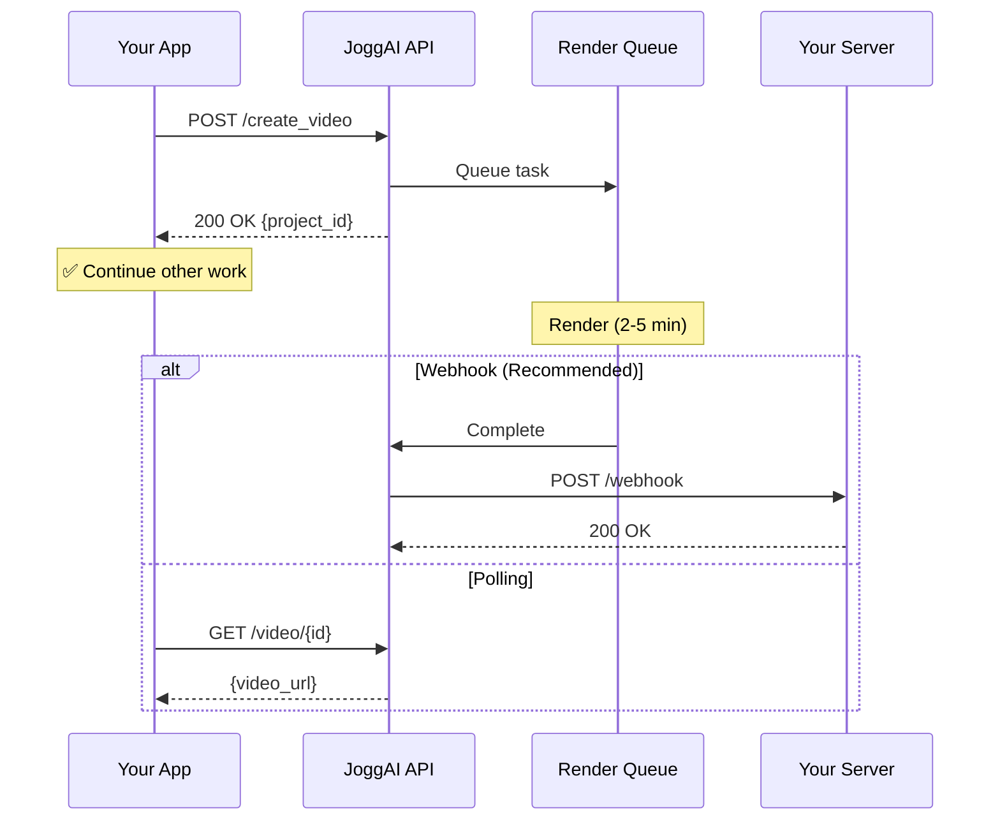

## Overview

The JoggAI API provides a powerful RESTful interface for creating AI-powered videos. All requests use JSON format and require API key authentication.

<Note>
  Sign up at [JoggAI Console](https://dashboard.jogg.ai) to get your API key
</Note>

## Base URL

```
https://api.jogg.ai/open/v2
```

All API endpoints are relative to this base URL.

## Authentication

JoggAI API uses API keys for authentication. Include your API key in the `x-api-key` header:

```bash
curl -X GET 'https://api.jogg.ai/open/v2/user/whoami' \
  -H 'x-api-key: YOUR_API_KEY'
```

<Warning>
  Keep your API key secure. Never expose it in client-side code or public repositories.
</Warning>

### Get Your API Key

<Steps>
  <Step title="Sign In">
    Log in to [JoggAI Console](https://dashboard.jogg.ai)
  </Step>
  <Step title="Navigate to API Settings">
    Click your avatar → Select "API" from the menu
  </Step>
  <Step title="Copy Your Key">
    Copy your API key and store it securely
  </Step>
</Steps>

### Test Your API Key

```bash
curl -X GET 'https://api.jogg.ai/open/v2/user/whoami' \
  -H 'x-api-key: YOUR_API_KEY'
```

**Expected Response:**

```json
{
  "code": 0,
  "msg": "Success",
  "data": {
    "userId": "user_123",
    "email": "user@example.com",
    "credits": 100
  }
}
```

## Asynchronous Processing

Video generation is asynchronous - you submit a request and receive results later:



<Tip>
  Use webhooks for real-time notifications instead of polling
</Tip>

## Rate Limits

<Info>
  - **Default:** 60 requests per minute
  - **Burst:** Up to 100 requests in short bursts
  - **Concurrent:** 10 simultaneous video generation requests
</Info>

Rate limit information is included in response headers:

```
X-RateLimit-Limit: 60
X-RateLimit-Remaining: 59
X-RateLimit-Reset: 1640000000
```

## Response Format

All API responses follow a consistent JSON structure:

### Success Response

```json
{
  "code": 0,
  "msg": "Success",
  "data": {
    // Response data here
  }
}
```

### Error Response

```json
{
  "code": 10105,
  "msg": "Invalid API key",
  "data": null
}
```

## Common Error Codes

<AccordionGroup>
<Accordion title="Authentication Errors (101xx)">
  | Code | Message | Solution |
  |------|---------|----------|
  | 10105 | Invalid API key | Check your API key is correct |
  | 10106 | API key expired | Generate a new API key |
  | 10107 | Unauthorized access | Verify your account permissions |
</Accordion>

<Accordion title="Request Errors (102xx)">
  | Code | Message | Solution |
  |------|---------|----------|
  | 10201 | Invalid request format | Check JSON syntax |
  | 10202 | Missing required parameter | Review API documentation |
  | 10203 | Invalid parameter value | Validate parameter types |
</Accordion>

<Accordion title="Resource Errors (103xx)">
  | Code | Message | Solution |
  |------|---------|----------|
  | 10301 | Resource not found | Verify resource ID |
  | 10302 | Resource already exists | Use different identifier |
  | 10303 | Resource limit exceeded | Upgrade your plan |
</Accordion>

<Accordion title="Rate Limit Errors (104xx)">
  | Code | Message | Solution |
  |------|---------|----------|
  | 10401 | Rate limit exceeded | Wait and retry with exponential backoff |
  | 10402 | Too many requests | Reduce request frequency |
</Accordion>

<Accordion title="Credit Errors (105xx)">
  | Code | Message | Solution |
  |------|---------|----------|
  | 10501 | Insufficient credits | Purchase more credits |
  | 10502 | Credit limit exceeded | Wait for credit reset |
</Accordion>
</AccordionGroup>

## API Categories

### Video Operations

<CardGroup cols={2}>
<Card title="Avatar Videos" icon="face-smile">
  Create talking avatar videos with professional avatars
</Card>

<Card title="Product Videos" icon="shopping-cart">
  Generate marketing videos from product information
</Card>

<Card title="Template Videos" icon="layer-group">
  Use templates for batch video generation
</Card>

<Card title="Video Translation" icon="globe">
  Translate existing videos into 40+ languages
</Card>
</CardGroup>

### Avatar Management

<CardGroup cols={2}>
<Card title="Library Avatars" icon="users">
  Access 200+ professional avatars
</Card>

<Card title="Photo Avatars" icon="camera">
  Create custom avatars from photos
</Card>

<Card title="Instant Avatars" icon="bolt">
  Quick avatar generation
</Card>
</CardGroup>

### Voice Management

<CardGroup cols={2}>
<Card title="Library Voices" icon="microphone">
  Access multiple voice options
</Card>

<Card title="Custom Voices" icon="waveform">
  Use your own voice recordings
</Card>
</CardGroup>

### Asset Management

<CardGroup cols={2}>
<Card title="Media Upload" icon="upload">
  Upload images, videos, and audio
</Card>

<Card title="Templates" icon="file">
  Manage video templates
</Card>

<Card title="Music Library" icon="music">
  Access background music
</Card>
</CardGroup>

## Pagination

List endpoints support pagination:

```bash
curl -X GET 'https://api.jogg.ai/open/v2/avatars?page=1&pageSize=20' \
  -H 'x-api-key: YOUR_API_KEY'
```

**Parameters:**
- `page`: Page number (default: 1)
- `pageSize`: Items per page (default: 20, max: 100)

**Response:**

```json
{
  "code": 0,
  "msg": "Success",
  "data": {
    "items": [...],
    "total": 100,
    "page": 1,
    "pageSize": 20
  }
}
```

## Webhooks

Configure webhooks to receive real-time notifications about video generation status.

<Card title="Webhook Integration" icon="webhook" href="/api-reference/openapi-v2#tag/Webhook">
  Learn how to set up webhooks for event notifications
</Card>

## Best Practices

<AccordionGroup>
<Accordion title="Security">
  - Store API keys in environment variables
  - Use HTTPS for all requests
  - Rotate API keys periodically
  - Implement request signing for sensitive operations
</Accordion>

<Accordion title="Performance">
  - Implement exponential backoff for retries
  - Cache frequently accessed data
  - Use webhooks instead of polling
  - Batch requests when possible
</Accordion>

<Accordion title="Error Handling">
  - Always check the `code` field in responses
  - Implement proper error handling for all error codes
  - Log errors for debugging
  - Display user-friendly error messages
</Accordion>
</AccordionGroup>

## Next Steps

<CardGroup cols={2}>
  <Card
    title="Create Avatar Videos"
    icon="user"
    href="/api-reference/workflows/avatar-videos/avatar-videos-overview"
  >
    Create talking avatar videos
  </Card>
  <Card
    title="Product Video Workflow"
    icon="shopping-bag"
    href="/api-reference/workflows/create-video-from-product"
  >
    Generate product marketing videos
  </Card>
  <Card
    title="Webhook Integration"
    icon="webhook"
    href="/api-reference/workflows/webhook-integration"
  >
    Set up real-time notifications
  </Card>
  <Card
    title="Authentication Guide"
    icon="key"
    href="/guides/authentication"
  >
    API authentication details
  </Card>
</CardGroup>

## Need Help?

If you have any questions, please contact us at [support@jogg.ai](mailto:support@jogg.ai)
