## Introduction

Create professional talking avatar videos by calling the JoggAI API. Choose from our library of realistic avatars, add your script, and generate videos in minutes.

<CardGroup cols={2}>
  <Card title="Realistic Avatars" icon="user">
    Choose from 100+ professional avatars
  </Card>
  <Card title="Natural Voices" icon="microphone">
    40+ languages with natural-sounding voices
  </Card>
  <Card title="Quick Generation" icon="bolt">
    Videos ready in 2-5 minutes
  </Card>
  <Card title="Customizable" icon="sliders">
    Control aspect ratio, background, and style
  </Card>
</CardGroup>

## How It Works

Avatar video creation is an **asynchronous process**:

<Steps>
  <Step title="Submit Task">
    Send a `POST` request with your script, avatar, and settings
  </Step>
  
  <Step title="Receive Confirmation">
    Get a `project_id` to track your video
  </Step>
  
  <Step title="Background Processing">
    Video renders in the background (2-5 minutes)
  </Step>
  
  <Step title="Retrieve Result">
    Get notified via webhook or poll for status

```mermaid
sequenceDiagram
    participant Client as Your App
    participant API as JoggAI API
    participant Queue as Render Queue
    
    Note over Client: 1. Prepare Resources
    Client->>API: GET /avatars/public
    API-->>Client: Avatar list
    Client->>API: GET /voices
    API-->>Client: Voice list
    
    Note over Client,Queue: 2. Create Video
    Client->>API: POST /create_video_from_avatar
    API->>Queue: Queue task
    API-->>Client: {project_id}
    
    Note over Client: ✅ Client can do other work now
    
    Note over Queue: 3. Background Processing
    Queue->>Queue: Render video<br/>(2-5 minutes)
    
    Note over Client,Queue: 4. Retrieve Result
    alt Webhook (Recommended)
        Queue->>API: Video complete
        API->>Client: POST /webhook<br/>{video_url, status}
    else Polling (Alternative)
        Client->>API: GET /avatar_video/{id}
        API-->>Client: {video_url, status}
    end
```

  </Step>
</Steps>



<Info>
  For detailed API specifications, refer to [Create Talking Avatar Video](/api-reference/video/create-talking-avatar-video) in the API Reference
</Info>

## Quick Start

### Step 1: Get Avatar and Voice IDs

```bash
# Get public avatars
curl --request GET \
  --url 'https://api.jogg.ai/open/v2/avatars/public' \
  --header 'x-api-key: YOUR_API_KEY'

# Get voices
curl --request GET \
  --url 'https://api.jogg.ai/open/v2/voices' \
  --header 'x-api-key: YOUR_API_KEY'
```

### Step 2: Create Video

```bash
curl --request POST \
  --url 'https://api.jogg.ai/open/v2/create_video_from_avatar' \
  --header 'x-api-key: YOUR_API_KEY' \
  --header 'Content-Type: application/json' \
  --data '{
    "script": "Welcome to JoggAI! Create amazing avatar videos with our API.",
    "avatar_id": 127,
    "voice_id": "en-US-ChristopherNeural",
    "aspect_ratio": 0,
    "screen_style": 0
  }'
```

**Response:**

```json
{
  "code": 0,
  "msg": "success",
  "data": {
    "project_id": "vid_abc123"
  }
}
```

<Check>
  Save the `project_id` to retrieve your video later!
</Check>

### Step 3: Get Video Status

```bash
curl --request GET \
  --url 'https://api.jogg.ai/open/v2/avatar_video/vid_abc123' \
  --header 'x-api-key: YOUR_API_KEY'
```

**Response (when complete):**

```json
{
  "code": 0,
  "data": {
    "project_id": "vid_abc123",
    "status": "completed",
    "video_url": "https://res.jogg.ai/videos/vid_abc123.mp4",
    "cover_url": "https://res.jogg.ai/covers/vid_abc123.jpg",
    "duration": 15
  }
}
```

## Key Parameters

### Required

| Parameter | Type | Description |
|-----------|------|-------------|
| `script` | string | The text your avatar will speak |
| `avatar_id` | number | Avatar ID from the library |
| `voice_id` | string | Voice ID for text-to-speech |
| `aspect_ratio` | number | 0: 16:9, 1: 9:16, 2: 1:1 |
| `screen_style` | number | 0: Full avatar, 1: Avatar + screen, 2: Circle avatar |

### Optional

| Parameter | Type | Description |
|-----------|------|-------------|
| `background_image` | string | Custom background image URL or asset_id |
| `background_video` | string | Custom background video URL or asset_id |
| `background_music` | string | Background music asset_id |
| `caption` | boolean | Enable subtitles (default: false) |

## Aspect Ratios

<CardGroup cols={3}>
  <Card title="16:9 Landscape" icon="rectangle-wide">
    YouTube, website embeds
    `aspect_ratio: 0`
  </Card>
  <Card title="9:16 Portrait" icon="mobile">
    TikTok, Instagram Reels
    `aspect_ratio: 1`
  </Card>
  <Card title="1:1 Square" icon="square">
    Instagram feed, Facebook
    `aspect_ratio: 2`
  </Card>
</CardGroup>

## Screen Styles

<AccordionGroup>
  <Accordion title="Style 0: Full Avatar">
    Avatar takes up the full frame. Best for talking head videos.
    ```json
    "screen_style": 0
    ```
  </Accordion>
  
  <Accordion title="Style 1: Avatar + Screen">
    Avatar on the side with a screen area for content. Great for presentations.
    ```json
    "screen_style": 1
    ```
  </Accordion>
  
  <Accordion title="Style 2: Circle Avatar">
    Avatar in a circle with custom background. Perfect for casual, friendly content.
    ```json
    "screen_style": 2
    ```
  </Accordion>
</AccordionGroup>

## Advanced Usage

<CardGroup cols={2}>
  <Card
    title="Use Photo Avatars"
    icon="camera"
    href="/api-reference/workflows/avatar-videos/avatar-videos-with-photo-avatar"
  >
    Create custom avatars from photos
  </Card>
  
  <Card
    title="Use Custom Audio"
    icon="microphone"
    href="/api-reference/workflows/avatar-videos/avatar-videos-with-audio-source"
  >
    Use your own audio instead of text-to-speech
  </Card>
  
  <Card
    title="Transparent Background"
    icon="droplet"
    href="/api-reference/workflows/avatar-videos/avatar-videos-transparent-background"
  >
    Create videos with transparent backgrounds
  </Card>
  
  <Card
    title="Webhook Integration"
    icon="webhook"
    href="/api-reference/workflows/webhook-integration"
  >
    Get notified when videos are ready
  </Card>
</CardGroup>

## Common Issues

<AccordionGroup>
  <Accordion title="Video Taking Too Long">
    **Normal Processing**: 2-5 minutes  
    **If longer**: Check status endpoint or webhook logs  
    **Peak times**: May take slightly longer during high traffic
  </Accordion>
  
  <Accordion title="Script Too Long">
    **Error**: Script exceeds duration limit  
    **Solution**: Split into multiple videos or reduce script length  
    **Tip**: Target 150-200 words per minute of video
  </Accordion>
  
  <Accordion title="Avatar Not Found">
    **Error**: Invalid avatar_id  
    **Solution**: Use `GET /avatars/public` to get valid avatar IDs  
    **Note**: Avatar IDs change occasionally, don't hardcode
  </Accordion>
  
  <Accordion title="Voice Not Available">
    **Error**: Invalid voice_id  
    **Solution**: Use `GET /voices` to get valid voice IDs  
    **Tip**: Test voices with different scripts for best match
  </Accordion>
</AccordionGroup>

## Best Practices

**Script Writing**
- Keep scripts concise and conversational
- Use short sentences for better pacing
- Add pauses with commas and periods
- Test different voices to find the best match

**Avatar Selection**
- Choose avatars that match your brand
- Consider your target audience demographics
- Test different avatars for engagement

**Technical Tips**
- Implement webhook notifications for better UX
- Cache avatar and voice lists (update daily)
- Use appropriate aspect ratios for your platform
- Enable captions for better accessibility

## Next Steps

<CardGroup cols={2}>
  <Card
    title="Create Photo Avatar"
    icon="camera"
    href="/api-reference/workflows/create-photo-avatar"
  >
    Generate custom avatars from photos
  </Card>
  
  <Card
    title="AI Scripts"
    icon="wand-magic-sparkles"
    href="/api-reference/workflows/ai-scripts"
  >
    Auto-generate video scripts with AI
  </Card>
  
  <Card
    title="Upload Media"
    icon="upload"
    href="/api-reference/workflows/upload-media/upload-media-overview"
  >
    Upload custom backgrounds and music
  </Card>
</CardGroup>

## Need Help?

For questions about avatar video creation, contact us at [support@jogg.ai](mailto:support@jogg.ai)

