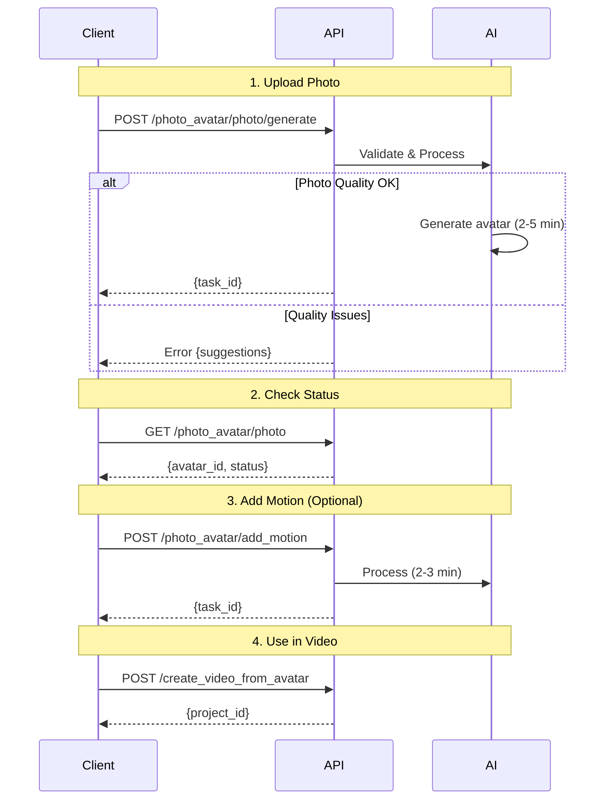

## Introduction

Transform any photo into a talking AI avatar. JoggAI's photo avatar feature allows you to create personalized avatars from portrait photos that can speak any script in any language.

### Use Cases

<CardGroup cols={2}>
  <Card title="Personal Brand" icon="user-tie">
    Create avatars of yourself or team members
  </Card>
  <Card title="Character Creation" icon="mask">
    Generate avatars for fictional characters
  </Card>
  <Card title="Product Spokesperson" icon="bullhorn">
    Create custom brand ambassadors
  </Card>
  <Card title="Multilingual Content" icon="language">
    One photo, speak in 40+ languages
  </Card>
</CardGroup>

## Workflow Overview



<Info>
  **Processing Time**: 2-5 min + 2-3 min (if motion)
</Info>

## Workflow

<Steps>
<Step title="1. Upload Photo">
  Upload a portrait photo to generate an AI avatar:
  
  ```bash
  curl -X POST 'https://api.jogg.ai/open/v2/photo_avatar/photo/generate' \
    -H 'x-api-key: YOUR_API_KEY' \
    -H 'Content-Type: application/json' \
    -d '{
      "photo_url": "https://example.com/portrait.jpg",
      "name": "John Doe Avatar"
    }'
  ```
  
  **Response:**
  ```json
  {
    "code": 0,
    "msg": "success",
    "data": {
      "task_id": "task_abc123",
      "status": "processing"
    }
  }
  ```
  
  <Warning>
  Photo generation takes 2-5 minutes
  </Warning>
</Step>

<Step title="2. Check Generation Status">
  Poll to check if the avatar is ready:
  
  ```bash
  curl -X GET 'https://api.jogg.ai/open/v2/photo_avatar/photo' \
    -H 'x-api-key: YOUR_API_KEY'
  ```
  
  **Completed Response:**
  ```json
  {
    "code": 0,
    "msg": "success",
    "data": {
      "avatars": [
        {
          "avatar_id": "photo_123",
          "name": "John Doe Avatar",
          "photo_url": "https://res.jogg.ai/avatars/photo_123.jpg",
          "status": "completed",
          "created_at": 1732806631
        }
      ]
    }
  }
  ```
  
  <Check>
  Save the `avatar_id` to use in video creation!
  </Check>
</Step>

<Step title="3. Create Video with Photo Avatar">
  Use your generated avatar in a video:
  
  ```bash
  curl -X POST 'https://api.jogg.ai/open/v2/create_video_from_avatar' \
    -H 'x-api-key: YOUR_API_KEY' \
    -H 'Content-Type: application/json' \
    -d '{
      "script": "Hello! I am your custom photo avatar.",
      "avatar_id": "photo_123",
      "avatar_type": 2,
      "voice_id": "en-US-ChristopherNeural",
      "aspect_ratio": 0,
      "caption": true
    }'
  ```
  
  **Response:**
  ```json
  {
    "code": 0,
    "data": {
      "project_id": "vid_def456"
    }
  }
  ```
</Step>

<Step title="4. Get Video">
  Check the video generation status:
  
  ```bash
  curl -X GET 'https://api.jogg.ai/open/v2/avatar_video/vid_def456' \
    -H 'x-api-key: YOUR_API_KEY'
  ```
  
  **Completed Response:**
  ```json
  {
    "code": 0,
    "data": {
      "video_url": "https://res.jogg.ai/videos/vid_def456.mp4",
      "status": "completed"
    }
  }
  ```
</Step>
</Steps>

## Photo Requirements

### Image Specifications

| Requirement | Description |
|-------------|-------------|
| **Format** | JPG, PNG, WebP |
| **Size** | Maximum 10MB |
| **Resolution** | Minimum 512x512px, Recommended 1024x1024px |
| **Aspect Ratio** | Square or portrait |
| **Face** | Clear, frontal, well-lit |

### Best Practices for Photos

<AccordionGroup>
  <Accordion title="Portrait Quality">
    **Good Photo:**
    - Face directly facing camera
    - Good lighting (no harsh shadows)
    - Clear facial features
    - Neutral or slight smile expression
    - Plain background
    - No glasses (or non-reflective)
    
    **Avoid:**
    - Side profile or angled face
    - Poor lighting or shadows
    - Blurry images
    - Obstructed face (hands, objects)
    - Busy backgrounds
    - Sunglasses or hats
  </Accordion>
  
  <Accordion title="Lighting">
    - Use natural light when possible
    - Avoid harsh overhead lighting
    - Ensure face is evenly lit
    - No strong shadows on face
    - Avoid backlit photos
  </Accordion>
  
  <Accordion title="Background">
    - Plain, solid color background works best
    - Avoid cluttered backgrounds
    - Good contrast with subject
    - No distracting elements
  </Accordion>
</AccordionGroup>

## Add Motion to Photo Avatar

Enhance your photo avatar with realistic movements:

```bash
curl -X POST 'https://api.jogg.ai/open/v2/photo_avatar/add_motion' \
  -H 'x-api-key: YOUR_API_KEY' \
  -H 'Content-Type: application/json' \
  -d '{
    "avatar_id": "photo_123",
    "motion_type": "natural"
  }'
```

**Response:**
```json
{
  "code": 0,
  "data": {
    "task_id": "motion_xyz789",
    "status": "processing"
  }
}
```

### Check Motion Generation Status

```bash
curl -X GET 'https://api.jogg.ai/open/v2/photo_avatar/add_motion?task_id=motion_xyz789' \
  -H 'x-api-key: YOUR_API_KEY'
```

## Avatar Types

When creating videos, specify the `avatar_type` parameter:

| Type | Value | Description |
|------|-------|-------------|
| Library Avatar | `0` | Public avatars from library |
| Instant Avatar | `1` | Quick generated avatars |
| Photo Avatar | `2` | Custom avatars from photos |
| Product Avatar | `3` | Product-specific avatars |

## Common Issues

<AccordionGroup>
<Accordion title="Photo Quality Too Low">
  **Error:** `Photo quality insufficient`
  
  **Solutions:**
  - Use higher resolution image (min 512x512)
  - Ensure image is not blurry
  - Use well-lit photo
  - Avoid heavily compressed images
</Accordion>

<Accordion title="Face Not Detected">
  **Error:** `No face detected in photo`
  
  **Solutions:**
  - Ensure face is clearly visible
  - Face should be frontal, not profile
  - Remove obstructions (hands, glasses, masks)
  - Ensure good contrast and lighting
</Accordion>

<Accordion title="Generation Failed">
  **Error:** `Avatar generation failed`
  
  **Solutions:**
  - Try different photo
  - Check photo meets requirements
  - Ensure photo URL is accessible
  - Verify file format is supported
  - Retry the generation
</Accordion>

<Accordion title="Avatar Looks Unnatural">
  **Problem:** Generated avatar doesn't look realistic
  
  **Solutions:**
  - Use higher quality source photo
  - Ensure proper lighting in photo
  - Try photo with neutral expression
  - Use photo with plain background
  - Consider professional headshot
</Accordion>
</AccordionGroup>

## Best Practices

<AccordionGroup>
  <Accordion title="Professional Headshots">
    Best results come from professional-quality photos:
    - Studio lighting or natural outdoor light
    - Professional camera or high-end smartphone
    - Properly focused and sharp
    - No filters or heavy editing
    - Natural skin tones
  </Accordion>
  
  <Accordion title="Test First">
    Before bulk processing:
    - Test with one photo first
    - Verify avatar quality
    - Test in actual video
    - Check different scripts and voices
    - Adjust source photo if needed
  </Accordion>
  
  <Accordion title="Multiple Angles">
    For best flexibility:
    - Create avatars from different angles
    - Have variations with different expressions
    - Test which works best for your use case
    - Keep originals for re-generation
  </Accordion>
  
  <Accordion title="Organize Avatars">
    Manage your photo avatars:
    - Use descriptive names
    - Keep track of avatar_ids
    - Document which photos work best
    - Maintain source photo library
  </Accordion>
</AccordionGroup>

## Tips for Better Results

<Tip>
  **Lighting is Key:** Use soft, even lighting that illuminates the face without harsh shadows. Natural outdoor light on an overcast day is ideal.
</Tip>

<Tip>
  **Background Matters:** A plain, single-color background helps the AI focus on the face and creates cleaner results.
</Tip>

<Tip>
  **Expression:** Slight smile or neutral expression works best. Avoid extreme expressions or emotions.
</Tip>

<Tip>
  **Camera Quality:** Higher quality cameras produce better results. Use the best camera available to you.
</Tip>

## Next Steps

<CardGroup cols={2}>
<Card title="Create Avatar Videos" icon="user" href="/api-reference/workflows/avatar-videos/avatar-videos-overview">
  Use your photo avatar in videos
</Card>

<Card title="Using Audio Source" icon="microphone" href="/api-reference/workflows/avatar-videos/avatar-videos-with-audio-source">
  Use custom audio with your avatar
</Card>

<Card title="Upload Media" icon="upload" href="/api-reference/workflows/upload-media/upload-media-overview">
  Upload photos and other media
</Card>
</CardGroup>

## Need Help?

For questions about photo avatar creation, contact us at [support@jogg.ai](mailto:support@jogg.ai)

