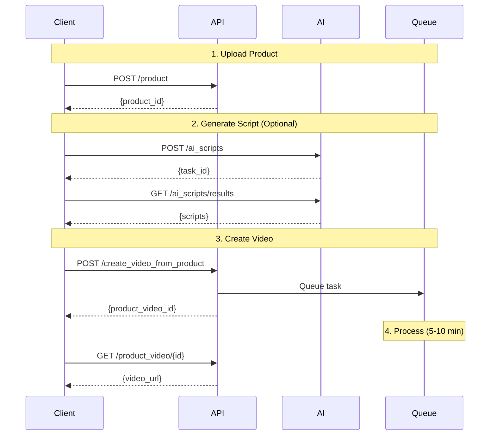

## Introduction

This guide will walk you through creating product marketing videos using the JoggAI API. Simply provide a product URL or product details, and our AI will generate a professional marketing video complete with script, visuals, and voiceover.

### Core Concept: Asynchronous Processing Flow

Product video generation is an **asynchronous operation** involving multiple steps:

<Steps>
  <Step title="Submit Product Information">
    Send product URL or details to JoggAI. Our AI analyzes the product and extracts key information.
  </Step>
  
  <Step title="Generate AI Script">
    AI automatically generates an engaging marketing script based on the product information.
  </Step>
  
  <Step title="Create Video">
    The system generates a complete video with the AI script, selected avatar, and voice.
  </Step>
  
  <Step title="Retrieve Result">
    Get the final video via webhook notification or by polling the status endpoint.
  </Step>
</Steps>

<Warning>
  The entire process can take 5-10 minutes depending on video complexity and server load.
</Warning>

## Workflow Overview



## Complete Workflow Example

Follow these steps to create a product video from URL:

<Steps>
<Step title="Upload Product URL">
  Create a product entry:
  
  ```bash
  curl -X POST 'https://api.jogg.ai/open/v2/product' \
    -H 'x-api-key: YOUR_API_KEY' \
    -H 'Content-Type: application/json' \
    -d '{
      "url": "https://example.com/product/amazing-gadget",
      "name": "Amazing Gadget"
    }'
  ```
  
  **Response:**
  ```json
  {
    "code": 0,
    "data": {
      "product_id": "prod_abc123"
    }
  }
  ```
</Step>

<Step title="Generate AI Script">
  Request AI to generate a marketing script:
  
  ```bash
  curl -X POST 'https://api.jogg.ai/open/v2/ai_scripts' \
    -H 'x-api-key: YOUR_API_KEY' \
    -H 'Content-Type: application/json' \
    -d '{
      "product_id": "prod_abc123",
      "script_type": "marketing",
      "language": "english"
    }'
  ```
  
  **Response:**
  ```json
  {
    "code": 0,
    "data": {
      "task_id": "task_xyz789"
    }
  }
  ```
</Step>

<Step title="Get Generated Script">
  Wait 10-30 seconds, then retrieve the script:
  
  ```bash
  curl -X GET 'https://api.jogg.ai/open/v2/ai_scripts/results/task_xyz789' \
    -H 'x-api-key: YOUR_API_KEY'
  ```
  
  **Response:**
  ```json
  {
    "code": 0,
    "data": {
      "status": "completed",
      "scripts": [
        {
          "script": "Discover the Amazing Gadget...",
          "duration": 30
        }
      ]
    }
  }
  ```
</Step>

<Step title="Create Video">
  Generate the video with the AI script:
  
  ```bash
  curl -X POST 'https://api.jogg.ai/open/v2/create_video_from_product' \
    -H 'x-api-key: YOUR_API_KEY' \
    -H 'Content-Type: application/json' \
    -d '{
      "product_id": "prod_abc123",
      "script": "Discover the Amazing Gadget...",
      "avatar_id": 127,
      "voice_id": "en-US-ChristopherNeural",
      "aspect_ratio": 0
    }'
  ```
  
  **Response:**
  ```json
  {
    "code": 0,
    "data": {
      "project_id": "video_def456"
    }
  }
  ```
</Step>

<Step title="Check Video Status">
  Monitor the video generation:
  
  ```bash
  curl -X GET 'https://api.jogg.ai/open/v2/product_videos' \
    -H 'x-api-key: YOUR_API_KEY'
  ```
  
  **When completed:**
  ```json
  {
    "code": 0,
    "data": {
      "videos": [
        {
          "video_id": "video_def456",
          "status": "completed",
          "video_url": "https://res.jogg.ai/videos/video.mp4"
        }
      ]
    }
  }
  ```
</Step>
</Steps>

## Best Practices

<AccordionGroup>
  <Accordion title="Use Webhooks for Production">
    Instead of polling, set up webhooks to receive notifications when videos are ready. This is more efficient and scalable.
    
    ```bash
    curl --request POST \
      --url 'https://api.jogg.ai/open/v2/webhooks' \
      --header 'x-api-key: YOUR_API_KEY' \
      --header 'Content-Type: application/json' \
      --data '{
        "url": "https://your-server.com/webhook",
        "events": ["video.completed", "video.failed"]
      }'
    ```
  </Accordion>
  
  <Accordion title="Cache Product Information">
    If you're generating multiple videos for the same product, reuse the `product_id` instead of creating new products each time.
  </Accordion>
  
  <Accordion title="Optimize Script Generation">
    Review and edit AI-generated scripts before creating videos. You can modify scripts to better match your brand voice.
  </Accordion>
  
  <Accordion title="Generate Previews First">
    Use the preview feature to explore different visual options before committing to a full video render.
  </Accordion>
</AccordionGroup>

## Common Issues

<AccordionGroup>
  <Accordion title="Invalid Product URL">
    **Error:** `Failed to extract product information`
    
    **Solutions:**
    - Ensure the URL is publicly accessible
    - Check that the product page contains proper meta tags
    - Manually provide product information if URL scraping fails
  </Accordion>
  
  <Accordion title="AI Script Generation Timeout">
    **Error:** `Script generation timed out`
    
    **Solutions:**
    - Retry the script generation
    - Provide more product details to help the AI
    - Use a manual script as fallback
  </Accordion>
  
  <Accordion title="Video Generation Failed">
    **Error:** `Video rendering failed`
    
    **Solutions:**
    - Check that all required fields are provided
    - Verify avatar_id and voice_id are valid
    - Ensure script length is within limits
    - Contact support if issue persists
  </Accordion>
</AccordionGroup>

## Status Codes Reference

| Status Code | Description | Next Action |
|-------------|-------------|-------------|
| 0 | Pending | Wait for processing |
| 1 | Processing | Video is being generated |
| 2 | Script generation | AI is creating script |
| 3 | Rendering | Video is being rendered |
| 4 | Completed | Video is ready! |
| 5 | Failed | Check error message |

## Next Steps

<CardGroup cols={2}>
  <Card
    title="Create Video from Template"
    icon="layer-group"
    href="/api-reference/workflows/create-video-from-template"
  >
    Use pre-designed templates for faster video creation
  </Card>
  
  <Card
    title="AI Scripts Guide"
    icon="wand-magic-sparkles"
    href="/api-reference/workflows/ai-scripts"
  >
    Learn more about AI script generation
  </Card>
  
  <Card
    title="Webhook Integration"
    icon="webhook"
    href="/api-reference/workflows/webhook-integration"
  >
    Set up webhooks for real-time notifications
  </Card>
</CardGroup>

## Need Help?

If you encounter any issues or have questions, please contact us at [support@jogg.ai](mailto:support@jogg.ai)

