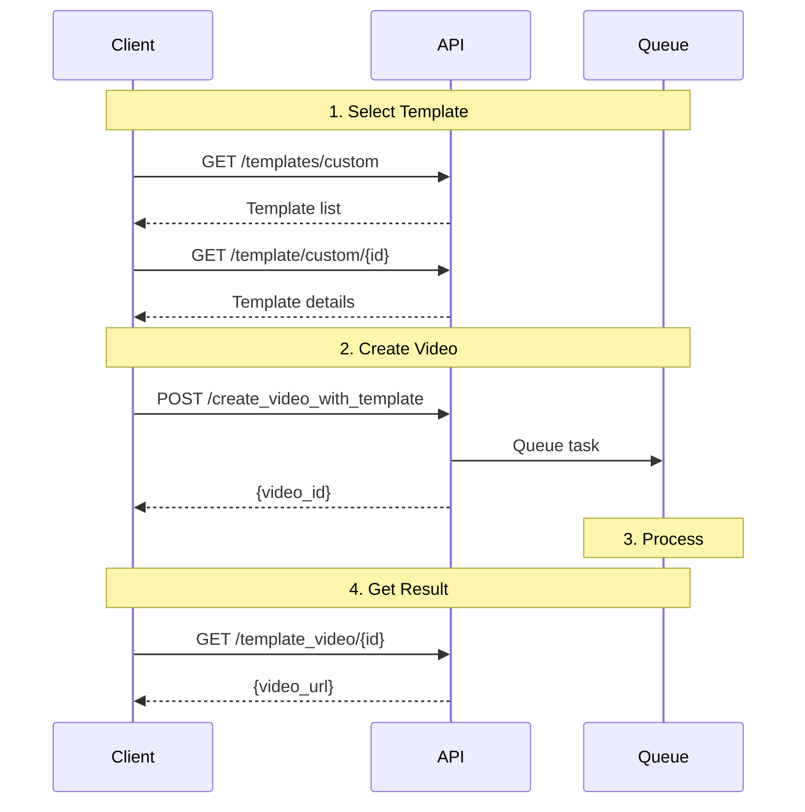

## Introduction

Templates provide a fast way to create professional videos with consistent branding. Use JoggAI's template library or create custom templates with your own branding and layout.

### Why Use Templates?

<CardGroup cols={2}>
  <Card title="Faster Creation" icon="bolt">
    Skip the design process with ready-made templates
  </Card>
  <Card title="Consistent Branding" icon="palette">
    Maintain brand consistency across all videos
  </Card>
  <Card title="Batch Processing" icon="layer-group">
    Generate multiple videos with the same style
  </Card>
  <Card title="Customizable" icon="sliders">
    Adjust colors, fonts, and layout to match your brand
  </Card>
</CardGroup>

## Workflow Overview



## Complete Workflow

Follow these steps to create a video from a template:

<Steps>
<Step title="Browse Available Templates">
  Get the list of available templates:
  
  ```bash
  curl -X GET 'https://api.jogg.ai/open/v2/templates/custom' \
    -H 'x-api-key: YOUR_API_KEY'
  ```
</Step>

<Step title="Get Template Details">
  View details of a specific template:
  
  ```bash
  curl -X GET 'https://api.jogg.ai/open/v2/template/custom/tmpl_123' \
    -H 'x-api-key: YOUR_API_KEY'
  ```
  
  This shows required fields and customization options.
</Step>

<Step title="Create Video">
  Submit your video creation request:
  
  ```bash
  curl -X POST 'https://api.jogg.ai/open/v2/create_video_with_template' \
    -H 'x-api-key: YOUR_API_KEY' \
    -H 'Content-Type: application/json' \
    -d '{
      "template_id": "tmpl_123",
      "video_name": "Product Showcase",
      "script": "Check out our amazing product!",
      "avatar_id": 127,
      "voice_id": "en-US-ChristopherNeural",
      "template_data": {
        "product_name": "Amazing Widget",
        "product_description": "The best widget on the market",
        "product_image_url": "https://example.com/widget.jpg"
      }
    }'
  ```
  
  **Response:**
  ```json
  {
    "code": 0,
    "msg": "success",
    "data": {
      "project_id": "vid_abc123"
    }
  }
  ```
</Step>

<Step title="Check Video Status">
  Monitor the video generation progress:
  
  ```bash
  curl -X GET 'https://api.jogg.ai/open/v2/template_videos' \
    -H 'x-api-key: YOUR_API_KEY'
  ```
  
  **When completed:**
  ```json
  {
    "code": 0,
    "data": {
      "videos": [
        {
          "video_id": "vid_abc123",
          "status": "completed",
          "video_url": "https://res.jogg.ai/videos/vid_abc123.mp4"
        }
      ]
    }
  }
  ```
</Step>
</Steps>

## Best Practices

<AccordionGroup>
  <Accordion title="Choose the Right Template">
    Select templates that match your content type and platform:
    - **9:16** for Instagram Stories, TikTok, YouTube Shorts
    - **16:9** for YouTube, Facebook, LinkedIn
    - **1:1** for Instagram Feed, Facebook posts
  </Accordion>
  
  <Accordion title="Optimize Content for Templates">
    - Keep scripts concise to fit template timing
    - Use high-quality images (minimum 1080p)
    - Ensure text is readable on small screens
    - Test on target platform before mass production
  </Accordion>
  
  <Accordion title="Batch Processing">
    When creating multiple videos:
    - Submit all requests first
    - Use webhooks for notifications
    - Implement retry logic for failed videos
    - Monitor rate limits
  </Accordion>
  
  <Accordion title="Brand Consistency">
    - Create custom templates for your brand
    - Use consistent colors across all videos
    - Include your logo in every video
    - Maintain same font family
  </Accordion>
</AccordionGroup>

## Common Issues

<AccordionGroup>
  <Accordion title="Template Not Found">
    **Error:** `Template ID does not exist`
    
    **Solutions:**
    - Verify the template_id is correct
    - Check that the template is available in your account
    - List all templates to find the correct ID
  </Accordion>
  
  <Accordion title="Missing Required Fields">
    **Error:** `Required template field missing`
    
    **Solutions:**
    - Get template details to see required fields
    - Ensure all required fields are provided in template_data
    - Check field names match exactly
  </Accordion>
  
  <Accordion title="Image URL Not Accessible">
    **Error:** `Failed to load image from URL`
    
    **Solutions:**
    - Ensure image URLs are publicly accessible
    - Use HTTPS URLs
    - Check image format (JPG, PNG, WebP supported)
    - Verify image size is within limits (max 10MB)
  </Accordion>
</AccordionGroup>

## Next Steps

<CardGroup cols={2}>
  <Card
    title="Create Avatar Videos"
    icon="user"
    href="/api-reference/workflows/avatar-videos/avatar-videos-overview"
  >
    Create videos with talking avatars
  </Card>
  
  <Card
    title="Product Video Workflow"
    icon="shopping-bag"
    href="/api-reference/workflows/create-video-from-product"
  >
    Generate videos from product URLs
  </Card>
  
  <Card
    title="Upload Media"
    icon="upload"
    href="/api-reference/workflows/upload-media/upload-media-overview"
  >
    Upload custom images and videos
  </Card>
</CardGroup>

## Need Help?

For questions about templates or custom template creation, contact us at [support@jogg.ai](mailto:support@jogg.ai)

