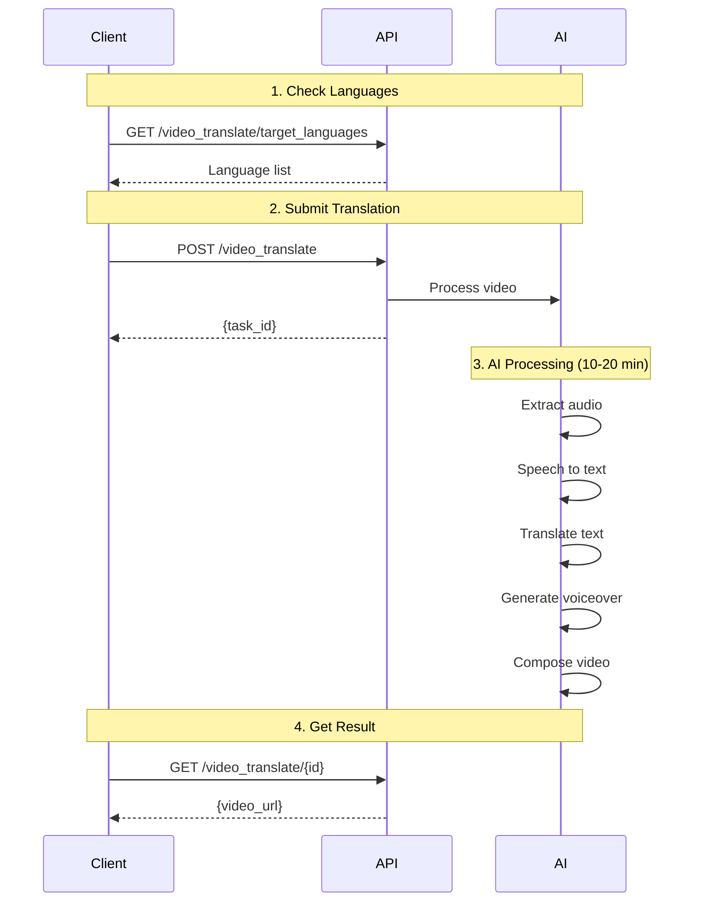

## Introduction

JoggAI supports translating existing videos into 40+ languages, including voiceover dubbing and subtitles generation.

### Why Use Video Translation?

<CardGroup cols={2}>
  <Card title="Global Reach" icon="globe">
    Expand your audience to international markets
  </Card>
  <Card title="Cost Effective" icon="dollar-sign">
    No need to recreate videos for each language
  </Card>
  <Card title="Maintain Quality" icon="star">
    Professional voiceover with natural-sounding voices
  </Card>
  <Card title="Fast Turnaround" icon="bolt">
    10-20 minutes average translation time
  </Card>
</CardGroup>

## Workflow Overview



<Info>
  **Processing Time**: 10-20 minutes
</Info>

## Supported Languages

JoggAI video translation supports 40+ languages:

<Tabs>
<Tab title="European Languages">
  - English
  - Spanish
  - French
  - German
  - Italian
  - Portuguese
  - Russian
  - Polish
  - Dutch
</Tab>

<Tab title="Asian Languages">
  - Chinese
  - Japanese
  - Korean
  - Thai
  - Vietnamese
  - Indonesian
  - Malay
  - Hindi
</Tab>

<Tab title="Other Languages">
  - Arabic
  - Turkish
  - Hebrew
  - And more...
</Tab>
</Tabs>

## Complete Workflow

Follow these steps to translate a video:

<Steps>
<Step title="Get Supported Languages">
  First, check which languages are available:
  
  ```bash
  curl -X GET 'https://api.jogg.ai/open/v2/video_translate/target_languages' \
    -H 'x-api-key: YOUR_API_KEY'
  ```
</Step>

<Step title="Submit Translation Task">
  Submit your video for translation:
  
  ```bash
  curl -X POST 'https://api.jogg.ai/open/v2/video_translate/' \
    -H 'x-api-key: YOUR_API_KEY' \
    -H 'Content-Type: application/json' \
    -d '{
      "video_url": "https://example.com/original.mp4",
      "target_language": "es",
      "voice_id": "es-ES-AlvaroNeural",
      "enable_subtitles": true
    }'
  ```
  
  **Response:**
  ```json
  {
    "code": 0,
    "msg": "success",
    "data": {
      "video_translate_id": "trans_abc123"
    }
  }
  ```
  
  <Check>
    Save the `video_translate_id` to check status later
  </Check>
</Step>

<Step title="Check Translation Status">
  Poll the status endpoint to see when translation is complete:
  
  ```bash
  curl -X GET 'https://api.jogg.ai/open/v2/video_translate/trans_abc123' \
    -H 'x-api-key: YOUR_API_KEY'
  ```
  
  **When completed:**
  ```json
  {
    "code": 0,
    "msg": "success",
    "data": {
      "status": "completed",
      "video_url": "https://res.jogg.ai/translated_video.mp4",
      "subtitle_url": "https://res.jogg.ai/subtitles.srt"
    }
  }
  ```
</Step>
</Steps>

## Common Issues

<AccordionGroup>
<Accordion title="How to Choose the Right Voice?">
  1. Use `/open/v2/voices` to get voice list for target language
  2. Listen to voice samples via `audition_url`
  3. Choose voice that matches original video style
</Accordion>

<Accordion title="What Video Formats Are Supported?">
  Common video formats are supported: MP4, MOV, AVI, WebM, etc.
</Accordion>

<Accordion title="What Subtitle Format Is Generated?">
  Generated subtitles are in standard SRT format, usable in most video players
</Accordion>

<Accordion title="Translation Takes Too Long">
  **Problem:** Translation exceeds expected time
  
  **Solutions:**
  - Check video length (longer videos take more time)
  - Verify video URL is accessible
  - Check server status
  - Contact support if issue persists
</Accordion>

<Accordion title="Poor Translation Quality">
  **Problem:** Translated voiceover doesn't sound natural
  
  **Solutions:**
  - Try different voices for the target language
  - Enable subtitles for better context
  - Ensure original audio is clear
  - Check if target language is well-supported
</Accordion>
</AccordionGroup>

## Best Practices

<AccordionGroup>
  <Accordion title="Optimize Source Video">
    Prepare your video for best translation results:
    - Use clear audio without background noise
    - Speak at moderate pace
    - Avoid complex jargon or slang
    - Use standard language pronunciation
  </Accordion>
  
  <Accordion title="Select Appropriate Voice">
    Choose voice that matches your content:
    - Match gender and age to original speaker
    - Consider formal vs casual tone
    - Test with short clips first
    - Listen to voice samples before committing
  </Accordion>
  
  <Accordion title="Use Subtitles">
    Benefits of enabling subtitles:
    - Improves translation accuracy
    - Helps viewers with hearing impairments
    - Useful in noisy environments
    - Aids in language learning
  </Accordion>
  
  <Accordion title="Batch Processing">
    When translating to multiple languages:
    - Submit separate translation requests for each language
    - Use the same `video_url` for all requests
    - Submit all translations together, then use webhooks for notifications
    - Wait 2 seconds between requests to avoid rate limits
  </Accordion>
  
  <Accordion title="Select the Right Voice">
    Choose voice that matches the target language:
    - Use `/open/v2/voices?language={language}` to browse voices
    - Listen to voice samples via `audition_url`
    - Match gender and tone to original speaker
    - If not specified, system will auto-select default voice
  </Accordion>
</AccordionGroup>

## Status Codes

| Status | Description | Action |
|--------|-------------|--------|
| `pending` | Task queued | Wait for processing |
| `processing` | Translation in progress | Continue polling |
| `completed` | Translation finished | Download video |
| `failed` | Translation failed | Check error message |

## Next Steps

<CardGroup cols={2}>
<Card title="Create Avatar Videos" icon="user" href="/api-reference/workflows/avatar-videos/avatar-videos-overview">
  Create videos with talking avatars
</Card>

<Card title="Product Videos" icon="shopping-cart" href="/api-reference/workflows/create-video-from-product">
  Generate product marketing videos
</Card>

<Card title="Webhook Integration" icon="webhook" href="/api-reference/workflows/webhook-integration">
  Get notified when translation completes
</Card>
</CardGroup>

## Need Help?

For questions about video translation, contact us at [support@jogg.ai](mailto:support@jogg.ai)

