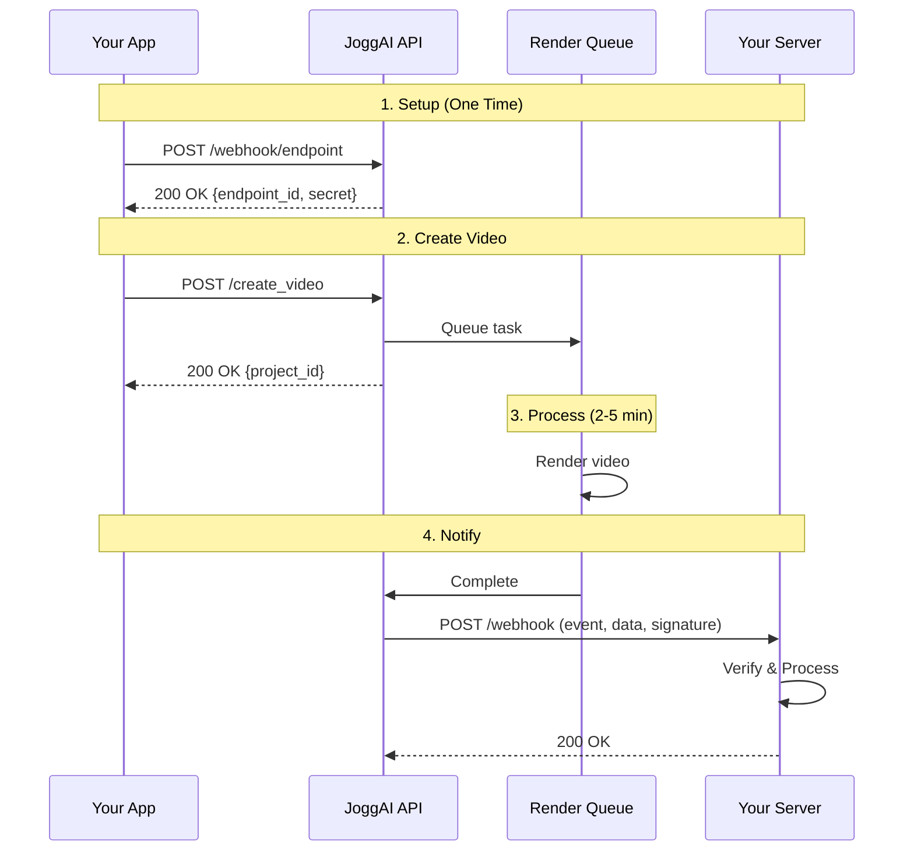

## Overview

JoggAI sends HTTP POST requests to your webhook endpoint when events occur (like video completion). This eliminates the need for polling and provides instant notifications.

<CardGroup cols={2}>
  <Card title="Real-Time Updates" icon="bolt">
    Get notified instantly when videos complete
  </Card>
  <Card title="Reduced API Calls" icon="arrows-down-to-line">
    No need to poll for status
  </Card>
  <Card title="Better UX" icon="face-smile">
    Respond to events immediately
  </Card>
  <Card title="Scalable" icon="chart-line">
    Handle high volumes efficiently
  </Card>
</CardGroup>

## Workflow Overview



<Info>
  Webhook requests expect a `200 OK` response within 10 seconds. Non-2xx responses trigger automatic retries.
</Info>

## Quick Start

### Step 1: Add Webhook Endpoint

```bash
curl --location --request POST 'https://api.jogg.ai/v1/webhook/endpoint' \
  --header 'x-api-key: YOUR_API_KEY' \
  --header 'Content-Type: application/json' \
  --data-raw '{
    "url": "https://example.com/webhook",
    "events": ["generated_video_success"],
    "status": "enabled"
  }'
```

**Response:**

```json
{
  "endpoint_id": "b1ac30a401234c96ad128303dfb431e2",
  "url": "https://example.com/webhook",
  "secret": "a1b2c3d4e5f6g7h8",
  "status": "enabled",
  "events": ["generated_video_success"],
  "username": "[email protected]",
  "created_at": 1703894400
}
```

<Check>
  Save the `secret` - you'll use it to verify webhook authenticity!
</Check>

### Step 2: Verify Webhook Signature

Always verify that webhooks come from JoggAI:

<AccordionGroup>
  <Accordion title="Go">
```go
func VerifyWebhookSignature(payload []byte, signature, secret string) bool {
    mac := hmac.New(sha256.New, []byte(secret))
    mac.Write(payload)
    expectedSignature := hex.EncodeToString(mac.Sum(nil))
    return hmac.Equal([]byte(signature), []byte(expectedSignature))
}
```
  </Accordion>
  
  <Accordion title="Python">
```python
import hmac
import hashlib

def verify_webhook_signature(payload, signature, secret):
    expected = hmac.new(
        secret.encode('utf-8'),
        payload,
        hashlib.sha256
    ).hexdigest()
    return hmac.compare_digest(signature, expected)
```
  </Accordion>
  
  <Accordion title="Node.js">
```javascript
const crypto = require('crypto');

function verifyWebhookSignature(payload, signature, secret) {
    const expected = crypto
        .createHmac('sha256', secret)
        .update(payload)
        .digest('hex');
    return crypto.timingSafeEqual(
        Buffer.from(signature),
        Buffer.from(expected)
    );
}
```
  </Accordion>
  
  <Accordion title="Bash">
```bash
verify_webhook() {
  local payload="$1"
  local signature="$2"
  local secret="$3"
  
  expected=$(echo -n "$payload" | openssl dgst -sha256 -hmac "$secret" | awk '{print $2}')
  
  if [ "$signature" = "$expected" ]; then
    echo "✅ Signature verified"
    return 0
  else
    echo "❌ Invalid signature"
    return 1
  fi
}
```
  </Accordion>
</AccordionGroup>

## Webhook Events

### Available Events

| Event | Description | When Triggered |
|-------|-------------|----------------|
| `generated_video_success` | Video generation succeeded | Video is ready to download |
| `generated_video_failed` | Video generation failed | An error occurred during generation |

### Event Payloads

<AccordionGroup>
  <Accordion title="Video Generation Success">
```json
{
  "event_id": "evt_123456789",
  "event": "generated_video_success",
  "timestamp": 1703894400,
  "data": {
    "project_id": "string",
    "video_url": "string",
    "duration": 30
  }
}
```
  </Accordion>
  
  <Accordion title="Video Generation Failed">
```json
{
  "event_id": "evt_123456789",
  "event": "generated_video_failed",
  "timestamp": 1703894400,
  "data": {
    "project_id": "string",
    "error": {
      "message": "string"
    }
  }
}
```
  </Accordion>
</AccordionGroup>

## Managing Webhooks

<AccordionGroup>
  <Accordion title="List All Webhooks">
```bash
curl --request GET 'https://api.jogg.ai/v1/webhook/endpoints' \
  --header 'x-api-key: YOUR_API_KEY'
```

Response includes all configured webhook endpoints with their settings.
  </Accordion>
  
  <Accordion title="Update Webhook">
```bash
curl --request PUT 'https://api.jogg.ai/v1/webhook/endpoint/{endpoint_id}' \
  --header 'x-api-key: YOUR_API_KEY' \
  --header 'Content-Type: application/json' \
  --data-raw '{
    "url": "https://new-url.com/webhook",
    "events": ["generated_video_success"],
    "status": "enabled"
  }'
```

Note: The `secret` cannot be modified.
  </Accordion>
  
  <Accordion title="Delete Webhook">
```bash
curl --request DELETE 'https://api.jogg.ai/v1/webhook/endpoint/{endpoint_id}' \
  --header 'x-api-key: YOUR_API_KEY'
```
  </Accordion>
  
  <Accordion title="List Available Events">
```bash
curl --request GET 'https://api.jogg.ai/v1/webhook/events' \
  --header 'x-api-key: YOUR_API_KEY'
```

Returns list of all supported webhook events.
  </Accordion>
</AccordionGroup>

## Security Requirements

### Request Headers

```bash
POST /webhook HTTP/1.1
Host: your-domain.com
Content-Type: application/json
X-Webhook-Event: generated_video_success
X-Webhook-Signature: 7256c87be255861cbbe92f4a04a4500176b045a287f258e32e5b6c6b96d7f290
User-Agent: Jogg-Webhook/1.0
```

### Security Checklist

- ✅ All webhook URLs must use HTTPS
- ✅ Verify `X-Webhook-Signature` header on every request
- ✅ Use HMAC SHA-256 with your secret key
- ✅ Signature is computed on raw request body
- ✅ Use constant-time comparison to prevent timing attacks
- ✅ Keep webhook secret secure (environment variables)
- ✅ Rotate secrets periodically

<Warning>
  Always verify signatures before processing webhooks. Reject requests with invalid signatures and log suspicious attempts.
</Warning>

## Best Practices

**Implementation**
- Return `200 OK` immediately (within 10 seconds)
- Process webhook data asynchronously in background jobs
- Don't make external API calls in the webhook handler
- Implement idempotency using `event_id`
- Store processed event IDs to prevent duplicate processing

**Error Handling**
- JoggAI retries failed webhooks (maximum 3 attempts with 5s delay)
- Only 2xx responses are considered successful
- Monitor webhook logs for delivery issues
- Set up alerts for repeated failures

**Monitoring**
- Track delivery success rate (target: > 99%)
- Monitor response time (target: under 1 second)
- Track retry rate (target: under 5%)
- Log all webhook attempts for debugging

<Tip>
  For local testing, use [ngrok](https://ngrok.com) to expose your localhost to the internet:
  ```bash
  ngrok http 3000
  # Use the ngrok URL as your webhook endpoint
  ```
</Tip>

## Common Issues

<AccordionGroup>
  <Accordion title="Webhook Not Receiving Requests">
    **Solutions:**
    - Verify URL is correct and publicly accessible
    - Ensure URL uses HTTPS with valid certificate
    - Check that webhook status is "enabled"
    - Test endpoint with `curl` from external source
    - Check firewall settings
  </Accordion>
  
  <Accordion title="Signature Verification Fails">
    **Solutions:**
    - Use the correct webhook secret
    - Include entire raw request body in calculation
    - Don't parse JSON before verification
    - Verify HMAC-SHA256 algorithm is used
    - Check for extra whitespace or encoding issues
  </Accordion>
  
  <Accordion title="Timeout Errors">
    **Solutions:**
    - Return 200 immediately (within 10 seconds)
    - Move processing to background job
    - Don't make external API calls in handler
    - Optimize database queries
  </Accordion>
  
  <Accordion title="Duplicate Webhooks">
    **Solutions:**
    - Implement idempotency using `event_id`
    - Store processed event IDs in database
    - Use database transactions
    - Check timestamp to detect duplicates
  </Accordion>
</AccordionGroup>

## Monitoring Metrics

Track these metrics to ensure reliable webhook processing:

| Metric | Description | Target |
|--------|-------------|--------|
| **Delivery Success Rate** | % of successful deliveries | > 99% |
| **Response Time** | Time to return 200 OK | under 1 second |
| **Retry Rate** | % of webhooks requiring retries | under 5% |
| **Error Rate** | % of failed webhooks | under 1% |

## Next Steps

<CardGroup cols={2}>
  <Card
    title="Create Avatar Videos"
    icon="user"
    href="/api-reference/workflows/avatar-videos/avatar-videos-overview"
  >
    Set up video creation with webhooks
  </Card>
  
  <Card
    title="Product Video Workflow"
    icon="shopping-bag"
    href="/api-reference/workflows/create-video-from-product"
  >
    Use webhooks for product videos
  </Card>
  
  <Card
    title="Error Handling"
    icon="triangle-exclamation"
    href="/guides/error-handling"
  >
    Handle webhook errors properly
  </Card>
</CardGroup>

## Need Help?

For questions about webhook integration, contact us at [support@jogg.ai](mailto:support@jogg.ai)

**Official Documentation**: https://docs.jogg.ai/api-reference/API%20Documentation/Webhook
